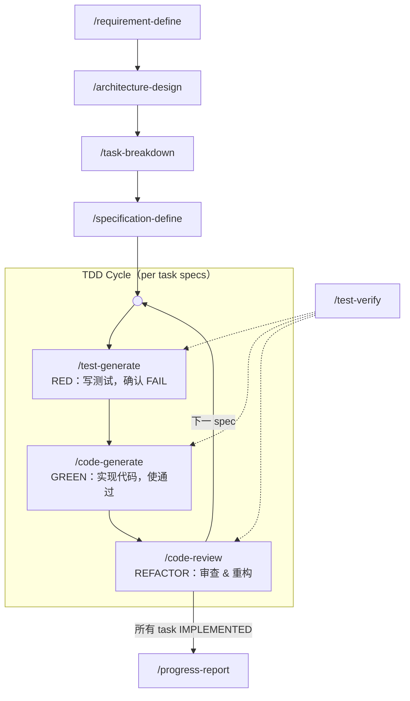

# SpecForge

**A specification-driven TDD workflow framework for AI coding agents**

[License: MIT] [Platform: OpenCode]

> ⚠ **该项目未完工** — 仍在积极开发中，命令行为、目录结构和文档内容均可能发生变更。

---

## 简介

SpecForge 是一套为 AI 编程 agent（[opencode](https://opencode.ai)）设计的**规范驱动 TDD 软件工程流水线**。它将自然语言需求逐步转化为精确的实现规格，通过测试先行（Test-First）、垂直切片、状态机追溯，确保每一行代码都「有据可依、有测可验、可回滚」。

**核心理念**：不让 AI agent 直接编码，而是先定义 Interface 契约 → 生成测试 → 确认测试 FAIL → 再写代码使测试通过 → 重构审查。全程由精确的状态机驱动，每个阶段都有严格的门控。

---

## 流水线概览



**线性段**：`requirement-define → architecture-design → task-breakdown → specification-define`，四个规划阶段顺序执行，逐层产生产物。

**循环段**：`test-generate → code-generate → code-review` 形成 TDD 循环，当前 task 下的每个 spec 依次走完 RED → GREEN → REFACTOR 后回到入口处理下一个 spec。当该 task 所有 specs 达到终态后，code-review 标记 task 为 `IMPLEMENTED`，然后 specification-define 可为下一个 task 生成新 spec，重新进入循环。

**test-verify** 作为共享验证节点（虚线连接），在 RED / GREEN / REFACTOR 三个阶段被复用，根据调用上下文判断 PASS/FAIL 语义。

---

## 核心特性

### 完整 TDD 流水线

RED（写测试，确认失败）→ GREEN（写实现，使测试通过）→ REFACTOR（审查重构），三个阶段之间有严格的门控状态转换，任一阶段 FAIL 时自动阻断并提示修复。

### 规格驱动

每次变更始于精确的 `Interface` 契约 + `Test Double` 策略 + `Test Cases` 列表。测试用例区分 `[自动化]`（代码断言验证）和 `[人工]`（交互/视觉验证），确保所有行为都被覆盖。

### Test Double 双保险模型

涉及外部边界（API、数据库、文件系统、邮件、时间/随机数等）的规格自动要求 Test Double 设计：

- **Layer 1**：Test Double → 自动化测试（核心逻辑路径验证，快速、确定性）
- **Layer 2**：人工测试 → 视觉/交互/真实集成验证（Test Double 不可达的残余差异）

二者叠加互补，非互斥。

### 16 种规格状态机

每条规格在 `[操作类型: 状态]` 格式下严格流转：

| 状态 | 设置者 | 含义 |
|------|--------|------|
| `[新增: 已定义]` | specification-define | 规格已定义，待生成测试 |
| `[新增: 测试已生成]` | test-generate | 测试已生成并确认 RED |
| `[新增: 已实现]` | code-generate | 代码已实现，待验证 |
| `[新增: 已测试]` | test-verify | 已通过测试，待审查 |
| `[新增: 待修复]` | test-verify | 测试失败，需修复 |
| `[新增: 已验证]` | code-review | 已通过审查（终态） |
| `[修改: 已定义]` | specification-define | 修改规格已定义 |
| `[修改: 测试已生成]` | test-generate | 修改测试已生成并确认 RED |
| `[修改: 已实现]` | code-generate | 修改已实施 |
| `[修改: 已测试]` | test-verify | 修改已通过测试 |
| `[修改: 待修复]` | test-verify | 修改测试失败 |
| `[修改: 已验证]` | code-review | 修改已通过审查（终态） |
| `[废弃: 待删除]` | specification-define | 待删除，需生成副作用验证测试 |
| `[废弃: 测试已生成]` | test-generate | 副作用验证测试已生成 |
| `[废弃: 待修复]` | test-verify | 副作用验证未通过 |
| `[废弃: 已删除]` | code-generate | 代码已删除并通过副作用检查（终态） |

### 代码感知回滚

任何上游阶段（requirement-define / architecture-design / task-breakdown / specification-define）修改文档时，自动扫描下游是否已有落地代码。若已落地，生成精确的 `git restore` 指令列表恢复代码，保证规划文档与代码始终一致。

### 苏格拉底式需求探询

`requirement-define` 不直接接受用户描述并起草，而是通过追问「为什么」、挑战隐含假设、展开替代方案、穷举边界条件，与用户达成深度共识后才产出文档。

### 递归完成传播

`code-review` 审查通过后自动向上追溯：检查当前 task 下所有 specs 是否全部达到终态，若是则将该 task 标记为 `[IMPLEMENTED]`。所有 task 完成后，提示用户运行 `progress-report` 收尾。

### 跨轮次归档

`progress-report` 在全部完成后自动生成总结、归档到 `planning/archive/`、追加 `changelist.md` 条目，为下一轮保留历史上下文。

---

## 安装

```bash
# 克隆到 opencode 配置目录
git clone https://github.com/<your-org>/specforge.git ~/.config/opencode/

# 或仅复制命令和技能文件
cp -r commands/ skills/ ~/.config/opencode/
```

安装后在 opencode 中运行 `/requirement-define` 即可启动流水线。

---

## 核心流水线命令

| 命令 | 阶段 | 说明 |
|------|------|------|
| `/requirement-define` | 规划 | 苏格拉底式对话定义需求目标、范围、约束和未决问题。产出 `planning/requirement.md` |
| `/architecture-design` | 规划 | 基于需求设计架构变更、影响分析和 Test Double 策略。产出 `planning/architecture.md` |
| `/task-breakdown` | 规划 | 将架构变更拆解为 DAG 任务列表，含依赖关系。产出 `planning/tasks.md` |
| `/specification-define` | 规划 | 为每个 task 定义实现规格：Interface、Test Double、Test Cases。产出 `planning/specifications.md` |
| `/test-generate` | **RED** | 根据规格生成测试代码，运行确认 FAIL。生成 Test Double 实现。 `[自动化]` 用例生成代码，`[人工]` 用例汇编为 checklist |
| `/code-generate` | **GREEN** | 读取测试代码理解期望行为，生成实现代码使测试通过。含 `[人工]` checklist 引导验证 |
| `/code-review` | **REFACTOR** | 代码审查 + 重构 + 回归测试。每次重构后运行回归测试，FAIL 则回退。通过后递归上溯传播完成信号 |
| `/test-verify` | 验证 | 独立测试运行器，被 test-generate / code-generate / code-review 复用，根据调用上下文判断 PASS/FAIL 语义 |
| `/progress-report` | 收尾 | 聚合进度统计，全部完成后归档到 `archive/`，追加 `changelist.md` 条目 |

---

## 辅助命令

| 命令 | 说明 |
|------|------|
| `/deep-debug` | 系统级 bug 排查，基于代码、测试与文档进行假设驱动分析 |
| `/explain-to-me` | 解释代码、架构或技术概念，综合本地代码与网络信息 |
| `/setup` | 初始化 `AGENTS.md`，写入流水线全局行为约束 |

---

## 内建技能

SpecForge 包含两个开箱即用的 opencode skill，在流水线中被自动调用：

### knowledge-augment

补全编程语言、框架或库的领域知识，提供简洁示例与常见陷阱。在 requirements / specifications / code-generate / deep-debug 等阶段被按需调用。

### style-resolver

自动检测项目语言和框架，基于已有代码或社区惯例生成 `style_guide.md`，确保所有代码风格一致。在 code-generate 和 code-review 阶段被自动调用。

---

## 项目结构

```
commands/               # 12 条流水线命令定义（Markdown + YAML frontmatter）
  architecture-design.md
  code-generate.md
  code-review.md
  deep-debug.md
  explain-to-me.md
  progress-report.md
  requirement-define.md
  setup.md
  specification-define.md
  task-breakdown.md
  test-generate.md
  test-verify.md
skills/                 # Agent 辅助技能
  knowledge-augment/
    SKILL.md
  style-resolver/
    SKILL.md
    style-guide-example.md
config.json             # OpenCode 提供者配置（示例模板）
package.json            # OpenCode 插件依赖
```

---

## 许可证

Apache License 2.0
