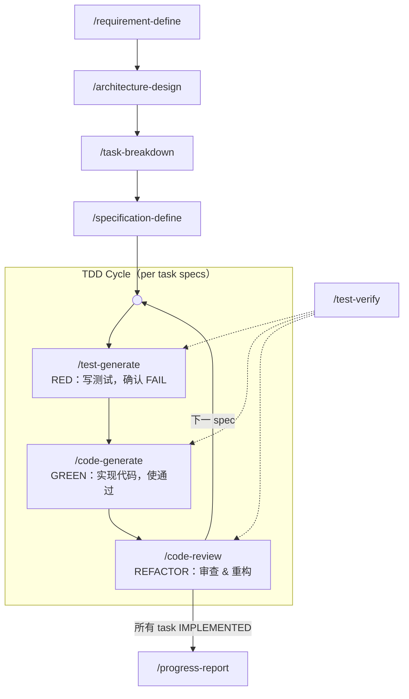

# SpecForge

**A specification-driven TDD workflow framework for AI coding agents**

[License: Apache-2.0] [Platform: OpenCode]

> ⚠ **该项目未完工** — 仍在积极开发中，命令行为、目录结构和文档内容均可能发生变更。

---

## 简介

SpecForge 是一套为 AI 编程 agent（[opencode](https://opencode.ai)）设计的**规范驱动 TDD 软件工程流水线**。它将自然语言需求逐步转化为精确的实现规格，通过测试先行（Test-First）、垂直切片、状态机追溯，确保每一行代码都「有据可依、有测可验、可回滚」。

**核心理念**：不让单个 AI agent 既设计、编码又自审自判，而是把职责拆分给多个**互不信任的 agent 对话**——先定义 Interface 契约 → 生成测试 → 确认测试 FAIL（RED）→ 再写代码使测试通过（GREEN）→ 重构审查（REFACTOR）。全程由精确的状态机驱动，每个阶段都有严格的门控，验证由中立测试运行器裁决。

---

## 设计理念

SpecForge 通过「**分离而非信任**」保证质量，建立在三条结构性原则之上：

1. **文件 = agent 上下文隔离** — 每个规划阶段各产出一份文档。每份文档是**独立 agent 对话**的主要工作上下文，自包含到「单次对话只读上一层、写自己的那一份」即可独立工作；没有哪个 agent 需要背负整条流水线的上下文。

2. **逐层递进** — 各规划层不是彼此的复制，而是对上一层的**更具体重写**：`目标与范围 → 变更与设计 → 可执行任务 → 精确接口契约与测试用例`。需求在每一层被进一步钉死，越往下越精确。

3. **对抗式 TDD 信任模型** — 编程阶段中，test / code / review 设计为由**互不信任的不同 agent** 执行：
   - **测试方**（`/test-generate`）：只信规格。写测试与 Test Double，并强制 RED（实现前测试必须失败）。
   - **实现方**（`/code-generate`）：只信测试。先读测试理解行为期望，再写实现。
   - **审查方**（`/code-review`）：审查代码与测试质量，重构，向上传播完成信号。
   - **中立裁决者**（`/test-verify`）：不生成任何代码，只凭测试结果判定并更新规格状态——对抗双方都无法自判自话。
   - **用户**是最终裁判，验证自动化无法到达的 `[人工]` 条目。

---

## 流水线概览



**三个阶段**：

1. **规划（线性）** — `requirement-define → architecture-design → task-breakdown → specification-define`。四个顺序阶段，每层产出一份自包含文档供下一层使用；单次对话只读上一层、写自己的那一层，保持 agent 上下文轻量。

2. **编程（TDD 循环）** — `test-generate → code-generate → code-review` 构成 RED → GREEN → REFACTOR 循环。当前 task 下的每个 spec 完整走完整个循环后才进入下一个 spec；当该 task 所有 specs 达到终态后，code-review 标记 task 为 `IMPLEMENTED`，然后 specification-define 为下一个 task 生成新 spec，重新进入循环。

3. **收尾** — `progress-report` 先通过硬性验收门（全量回归、Goal 可追溯、Open Questions 关闭），再归档本轮。

**test-verify** 作为**中立测试运行器**（虚线连接），在 RED / GREEN / REFACTOR 三个阶段被复用，根据调用上下文判断 PASS/FAIL 语义。它不生成任何代码，仅凭测试结果推进规格状态——测试方与实现方都无法自审自判；同时为 `code-review` 的影响范围回归和 `progress-report` 的全量回归提供执行。

---

## 核心特性

### 完整 TDD 流水线

RED（写测试，确认失败）→ GREEN（写实现，使测试通过）→ REFACTOR（审查重构），三个阶段之间有严格的门控状态转换，任一阶段 FAIL 时自动阻断并提示修复。

### 对抗式 TDD 角色分工

test / code / review 设计为由**互不信任的不同 agent** 执行：测试方写必须失败（RED）的测试，实现方仅以实现满足测试为目标（GREEN），审查方审查代码与测试质量（REFACTOR），`/test-verify` 只凭测试结果裁决。`[人工]` 条目由用户作为最终裁判验证。

### 规格驱动

每次变更始于精确的 `Interface` 契约 + `Test Double` 策略 + `Test Cases` 列表。测试用例区分 `[自动化]`（代码断言验证）和 `[人工]`（交互/视觉验证），确保所有行为都被覆盖。

### Test Double 双保险模型

涉及外部边界（API、数据库、文件系统、邮件、时间/随机数等）的规格自动要求 Test Double 设计：

- **Layer 1**：Test Double → 自动化测试（核心逻辑路径验证，快速、确定性）
- **Layer 2**：人工测试 → 视觉/交互/真实集成验证（Test Double 不可达的残余差异）

二者叠加互补，非互斥。

### 16 种规格状态机

每条规格在 `[操作类型: 状态]` 格式下严格流转。状态机是**跨 agent 的交接契约语言**：每个 agent 读取规格状态决定做什么、如何验证，并通过推进状态完成交接；状态只由拥有它的命令推进。

| 状态 | 设置者 | 含义 |
|------|--------|------|
| `[新增: 已定义]` | specification-define | 规格已定义，待生成测试 |
| `[新增: 测试已生成]` | test-generate | 测试已生成并确认 RED |
| `[新增: 已实现]` | code-generate | 代码已实现，待验证 |
| `[新增: 已测试]` | test-verify | 已通过测试，待审查 |
| `[新增: 待修复]` | test-verify | 测试失败，需修复 |
| `[新增: 已验证]` | code-review | 已通过审查（终态） |
| `[修改: 已定义]` | specification-define | 修改规格已定义 |
| `[修改: 测试已生成]` | test-generate | 修改测试已生成并确认 RED |
| `[修改: 已实现]` | code-generate | 修改已实施 |
| `[修改: 已测试]` | test-verify | 修改已通过测试 |
| `[修改: 待修复]` | test-verify | 修改测试失败 |
| `[修改: 已验证]` | code-review | 修改已通过审查（终态） |
| `[废弃: 待删除]` | specification-define | 规格已定义（含待删目标与 `Depended By`），待解引用 |
| `[废弃: 已解引用]` | code-generate | 引用方已全部移除，代码已移入 `_deprecated/`，定向测试 + 全量构建通过 |
| `[废弃: 待修复]` | test-verify | 解引用验证未通过，需修复受影响模块后重试 |
| `[废弃: 已删除]` | progress-report | `_deprecated/` 中代码已物理删除（progress-report 收尾），终态 |

### 废弃代码生命周期

废弃是行为减量，不适用测试先行。废弃规格走独立的生命周期：

1. **定义**：`specification-define` 记录待删目标及其 `Depended By`（以 `# Dependency Index` 为起点、`grep` 实测为准），并将验证手段清单（定向测试 / 全量构建 / grep 引用扫描）写入 `Test Cases`
2. **跳过测试生成**：`test-generate` 完全跳过废弃规格——不生成任何测试代码，也不做 RED 确认
3. **解引用与移动**：`code-generate` 移除全部引用、将代码移入 `_deprecated/`（从构建/测试配置排除）、同步 `# Dependency Index` 与 `Depended By`，随后 `test-verify` 执行验证清单
4. **收尾删除**：`progress-report` 物理删除 `_deprecated/` 并置为 `[废弃: 已删除]`

### 模块引用索引（Dependency Index）

`architecture-design` 在 `architecture.md` 中维护模块级双向引用索引（`# Dependency Index`：Module / Depends On / Depended By），随每次变更保持最新。待废弃/删除的模块必须在 `Depended By` 中列出全部引用方——这是 `code-generate` 解引用与 `progress-report` 物理删除决策的依据。对废弃规格而言，权威的 `Depended By` 来自对代码库的实际 `grep` 扫描，而非仅依赖索引。

### 代码感知回滚

任何上游阶段（requirement-define / architecture-design / task-breakdown / specification-define）修改文档时，自动扫描下游是否已有落地代码。若已落地，基于 round 开始时的 baseline（requirement.md frontmatter 记录的 git HEAD）生成精确的 `git restore --source <baseline>` 指令列表恢复代码，保证规划文档与代码始终一致。已解引用的代码（`[废弃: 已解引用]`）还需删除 `_deprecated/` 及其中的移动副本；已物理删除的代码（`[废弃: 已删除]`）须用 `git log --diff-filter=D` 从 git 历史定位找回。

### 苏格拉底式需求探询

`requirement-define` 不直接接受用户描述并起草，而是通过追问「为什么」、挑战隐含假设、展开替代方案、穷举边界条件，与用户达成深度共识后才产出文档。

### 递归完成传播

`code-review` 审查通过后自动向上追溯：检查当前 task 下所有 specs 是否全部达到终态，若是则将该 task 标记为 `[IMPLEMENTED]`。所有 task 完成后，提示用户运行 `progress-report` 收尾。废弃规格以 `[废弃: 已解引用]` 为终态——物理删除延后到 `progress-report` 收尾统一执行。

### 跨轮次归档

`progress-report` 在收尾前先强制通过硬性验收门——全量回归 PASS、`# Goal` 可追溯性确认、`# Open Questions` 全部关闭。随后物理删除 `_deprecated/`，自动生成总结、归档所有规划文件（含 `style_guide.md`）到 `planning/archive/`、追加 `changelist.md` 条目，为下一轮保留历史上下文。

---

## 安装

```bash
# 克隆到 opencode 配置目录
git clone https://github.com/<your-org>/specforge.git ~/.config/opencode/

# 或仅复制命令和技能文件
cp -r commands/ skills/ ~/.config/opencode/
```

安装后在 opencode 中运行 `/requirement-define` 即可启动流水线。

---

## 核心流水线命令

| 命令 | 阶段 | 说明 |
|------|------|------|
| `/requirement-define` | 规划 | 苏格拉底式对话定义需求目标、范围、约束和未决问题。产出 `planning/requirement.md` |
| `/architecture-design` | 规划 | 基于需求设计架构变更、影响分析和 Test Double 策略。产出 `planning/architecture.md` |
| `/task-breakdown` | 规划 | 将架构变更拆解为 DAG 任务列表，含依赖关系。产出 `planning/tasks.md` |
| `/specification-define` | 规划 | 为每个 task 定义实现规格：Interface、Test Double、Test Cases。产出 `planning/specifications.md` |
| `/test-generate` | **RED（测试方）** | 根据规格生成测试代码，运行确认 FAIL。生成 Test Double 实现。 `[自动化]` 用例生成代码，`[人工]` 用例汇编为 checklist |
| `/code-generate` | **GREEN（实现方）** | 读取测试代码理解期望行为，生成实现代码使测试通过。含 `[人工]` checklist 引导验证 |
| `/code-review` | **REFACTOR（审查方）** | 代码审查 + 重构 + 回归测试。每次重构后运行**影响范围回归**（覆盖受影响文件重叠的 `[已验证]` 规格），FAIL 则回退；并审查测试代码质量。通过后递归上溯传播完成信号 |
| `/test-verify` | 验证（中立） | 中立测试运行器，被 test-generate / code-generate / code-review / progress-report 复用。按调用上下文判断 PASS/FAIL；区分失败类型（断言失败 vs error，RED 时支持 stub 占位回退）；执行影响范围回归（code-review）与全量回归（progress-report）；废弃规格执行验证清单（定向测试 + 全量构建 + grep 引用扫描） |
| `/progress-report` | 收尾 | 通过全量回归 + Goal 可追溯确认 + Open Questions 关闭的硬性验收门后，物理删除 `_deprecated/`（将 `[废弃: 已解引用]` 更新为 `[废弃: 已删除]`），归档到 `archive/`，追加 `changelist.md` 条目 |

---

## 辅助命令

| 命令 | 说明 |
|------|------|
| `/deep-debug` | 系统级 bug 排查，基于代码、测试与文档进行假设驱动分析 |
| `/explain-to-me` | 解释代码、架构或技术概念，综合本地代码与网络信息 |
| `/setup` | 初始化 `AGENTS.md`，写入流水线全局行为约束 |

---

## 内建技能

SpecForge 包含两个开箱即用的 opencode skill，在流水线中被自动调用：

### knowledge-augment

补全编程语言、框架或库的领域知识，提供简洁示例与常见陷阱。在 requirements / specifications / code-generate / deep-debug 等阶段被按需调用。

### style-resolver

自动检测项目语言和框架，基于已有代码或社区惯例生成 `style_guide.md`，确保所有代码风格一致。在 code-generate 和 code-review 阶段被自动调用。

---

## 项目结构

```
commands/               # 12 条流水线命令定义（Markdown + YAML frontmatter）
  architecture-design.md
  code-generate.md
  code-review.md
  deep-debug.md
  explain-to-me.md
  progress-report.md
  requirement-define.md
  setup.md
  specification-define.md
  task-breakdown.md
  test-generate.md
  test-verify.md
skills/                 # Agent 辅助技能
  knowledge-augment/
    SKILL.md
  style-resolver/
    SKILL.md
    style-guide-example.md
config.json             # OpenCode 提供者配置（示例模板）
package.json            # OpenCode 插件依赖
```

---

## 许可证

Apache License 2.0
