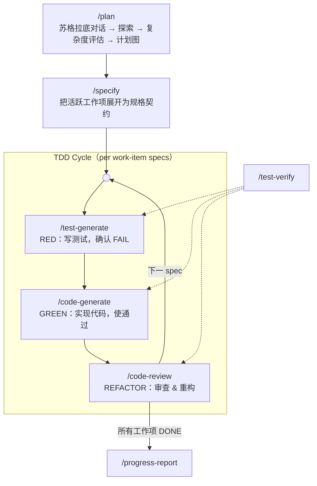

# SpecForge

**面向 AI 编程 agent 的规格驱动 TDD 工作流框架**

[License: Apache-2.0] [Platform: OpenCode]

> ⚠ **该项目未完工** — 仍在积极开发中，命令行为、目录结构和文档内容均可能发生变更。

---

## 简介

SpecForge 是一套为 AI 编程 agent（[opencode](https://opencode.ai)）设计的**规范驱动 TDD 软件工程流水线**。它将自然语言需求转化为一张**计划图**（工作项为节点），在每个工作项即将执行前把它展开为精确的实现规格，再由多个独立 agent 对话推进测试先行的工程流程，全程由严格的状态机门控。

**核心理念**：不让单个 AI agent 既设计、编码又自审自判，而是把职责拆分给多个**互不信任的 agent 对话**——先定义 Interface 契约 → 生成测试 → 确认测试 FAIL（RED）→ 再写代码使测试通过（GREEN）→ 重构审查（REFACTOR）。每一行代码都可追溯到规格，由中立测试运行器裁决，并通过**局部失效**（而非整轮回滚）恢复。

---

## 设计理念

SpecForge 通过「**分离而非信任**」保证质量，建立在三条结构性原则之上：

1. **文件 = agent 上下文隔离** — 每个规划产物是**独立 agent 对话**的主要工作上下文，自包含到「单次对话只读自己需要的文档、写自己的输出」即可独立工作；没有哪个 agent 需要背负整条流水线的上下文。

2. **证据条件化的计划图** — 规划不是固定链条，而是一张**图**：节点是工作项（带依赖边与显式失败路由），结构由证据和复杂度决定，而非预设顺序。`complexity: minimal | task | full` 决定本轮需要几层规划；规格**按需懒展开**（每个工作项执行前才定义），而非一次性全量定义。简单任务自然塌缩为短链——这是设计而非退化。

3. **对抗式 TDD 信任模型** — 编程阶段中，test / code / review 设计为由**互不信任的不同 agent** 执行：
   - **测试方**（`/test-generate`）：只信规格。写测试与 Test Double，并强制 RED（实现前测试必须失败）。测试代码的唯一责任方——`[测试缺陷]` 路由的修复也只由它执行。
   - **实现方**（`/code-generate`）：只信测试。先读测试理解行为期望，再写实现；**永不修改测试代码**——疑似测试错误只能分类路由。
   - **审查方**（`/code-review`）：审查代码与测试质量，重构，向上传播完成信号。
   - **中立裁决者**（`/test-verify`）：不生成任何代码，只凭测试结果判定并更新规格状态——对抗双方都无法自判自话；FAIL 时按失败路由协议对 Issues 三分类。
   - **用户**是最终裁判，验证自动化无法到达的 `[人工]` 条目，结果由 code-generate 回写 specs.md 落地。

---

## 流水线概览



**三个阶段**：

1. **规划（自适应）** — `/plan` 执行苏格拉底四问（为什么 / 隐含假设 / 替代方案 / 边界条件）、探索代码库、评估复杂度（`minimal | task | full`），产出**计划图**（`planning/plan.md`：工作项 + 依赖 + 失败路由）。`/specify` 把活跃工作项懒展开为规格契约（`planning/specs.md`）——就在它进入 TDD 循环之前。工作项过大时拆回计划图（运行时分解）。计划修订通过**变更分类 + 影响规则**传播，只失效受影响的工作项。

2. **编程（TDD 循环）** — `test-generate → code-generate → code-review` 构成 RED → GREEN → REFACTOR 循环。当前工作项的每个规格完整走完循环后才处理下一个。工作项的全部规格到达终态后，code-review 将其标记为 `DONE`（写回 plan.md），`/specify` 便可展开下一个工作项。

3. **收尾** — `progress-report` 强制执行验收硬门（全量回归、Goal 可追溯、未决问题全部关闭），然后归档轮次。

**test-verify**（虚线）是复用于全部三个 TDD 阶段的**中立测试运行器**，按调用上下文解释 PASS/FAIL。它不生成代码，只凭测试结果推进规格状态——测试方与实现方都无法自审自判。FAIL 时按失败路由协议对 Issues 三分类。它也支撑 `code-review` 的影响范围回归（含重构前基线回归）与 `progress-report` 的全量回归。

非行为变更（chore / docs）走**轻量 spec** 路径：跳过 RED，实现后经 `/test-verify` 轻量验收与 `/code-review` 审查，共享同一终态。返工由**失败路由协议**驱动——三类 Issues（`[实现缺陷]` / `[测试缺陷]` / `[规格缺陷]`）分别路由回实现 / 测试 / 规格阶段。失败被路由到**正确的恢复目标**，而非重跑整条链。

---

## 关键特性

### 完整 TDD 流水线

RED（写测试，确认 FAIL）→ GREEN（实现，使通过）→ REFACTOR（审查 & 重构）。每个阶段都有严格状态守卫——任一步 FAIL 都会阻断推进并要求修复。

### 对抗式 TDD 角色

test / code / review 设计为由**互不信任的不同 agent** 执行：测试方写必须失败的测试（RED），实现方只为实现它们而写码（GREEN），审查方审查双方（REFACTOR），`/test-verify` 只凭测试结果裁决。`[人工]` 条目由用户作为最终权威判定。

### 自适应规划（计划图）

四个固定阶段（需求 → 架构 → 任务 → 规格）融合为一张**计划图**（`planning/plan.md`）：

- **工作项 = 节点**：类型（小集合：内部实现 / API 签名 / 数据结构 / 纯新增 / 纯删除 / 文档配置）、引用证据的一句话描述、`Depends On`（ON-SUCCESS 先决拓扑）、`Affects`、可选设计引用、状态（`TODO` / `ACTIVE` / `DONE`）
- **失败路由 = ON-FAILURE 边**：默认三分类路由；允许按工作项覆盖（如「`[实现缺陷]` 时先检查上游 W2 是否改了 API 签名——表面报错点可能不是根因点」）
- **证据条件化简约**：复杂度评估（信号：模块数、API/签名变更、数据结构变更、开放边界、跨模块依赖）决定是否需要设计节点；`minimal` 轮次完全跳过设计层
- **延后工作**：执行中发现的新工作项登记进图，由 `/specify` 展开（运行时分解）
- **负证据**：失败尝试被记录，同一方案不得原样重试

### 规格即契约（懒展开）

规格**不**在轮次开始时全量定义。`/specify` 每次只展开一个工作项——活跃工作项（首个「Depends On 全部 DONE」的 TODO）——就在它进入 TDD 循环之前。每个规格包含：`Spec`（可生成 diff 的行为）、`Interface`（精确签名，必须支持依赖注入）、`Test Double`（仅开放边界）、`Test Cases`（`[自动化]` 验证 WHAT + `[人工]` 含操作/预期/通过标准三要素）。工作项大到装不下一个 diff 时，拆回计划图。

### Test Double 双层模型

涉及开放边界（外部 API、数据库、文件系统、邮件、时间/随机性）的规格自动要求 Test Double 设计：

- **第一层**：Test Double → 自动化测试（快速、确定性的核心逻辑覆盖）
- **第二层**：人工测试 → 可视化/交互式/真实集成检查（Test Double 无法到达的残余缺口）

两层是叠加关系，互不排斥。

### 16 态规格状态机

每个规格用 `[操作类型: 状态]` 格式走严格状态机。状态机是**跨 agent 交接契约语言**：每个 agent 读规格状态决定行为与验证方式，再推进状态交接。状态只由拥有它的命令推进。

| 状态 | 设置者 | 含义 |
| ------ | -------- | ------ |
| `[新增: 已定义]` | specify | 规格已定义，待生成测试 |
| `[新增: 测试已生成]` | test-generate | 测试已生成并确认 RED |
| `[新增: 已实现]` | code-generate | 代码已实现，待验证 |
| `[新增: 已测试]` | test-verify | 已通过测试，待审查 |
| `[新增: 待修复]` | test-verify / code-review | 验证未通过，按失败路由协议返工 |
| `[新增: 已验证]` | code-review | 已通过审查（终态） |
| `[修改: 已定义]` | specify | 修改规格已定义 |
| `[修改: 测试已生成]` | test-generate | 修改测试已生成并确认 RED |
| `[修改: 已实现]` | code-generate | 修改已实施 |
| `[修改: 已测试]` | test-verify | 修改已通过测试 |
| `[修改: 待修复]` | test-verify / code-review | 修改验证未通过，按失败路由协议返工 |
| `[修改: 已验证]` | code-review | 修改已通过审查（终态） |
| `[废弃: 待删除]` | specify | 已定义（含待删目标与 Depended By），待解引用 |
| `[废弃: 已解引用]` | code-generate | 引用方已全部移除，代码已移入 `_deprecated/`，验证清单（定向测试 + 全量构建 + grep 引用扫描）通过 |
| `[废弃: 待修复]` | test-verify / code-review | 解引用验证未通过，按失败路由协议返工 |
| `[废弃: 已删除]` | progress-report | `_deprecated/` 代码已物理删除（收尾），终态 |

工作项在 plan.md 中带粗粒度三态标记：`TODO`（未展开）→ `ACTIVE`（规格已定义或执行中）→ `DONE`（全部规格终态）；细节由规格 16 态承载。

轻量规格与常规规格共用本状态表，仅跳过 test-generate 阶段（见「轻量规格」）。规范的 16 态表位于 `/setup` 写入的 `AGENTS.md`（§状态机与记法规范）；各命令的状态过滤规则在各自命令文件内。命令文件行文可用竖线简写 `[新增|修改: x]` 作并列枚举，但写入 planning/ 文档时必须用完整 `[操作类型: 状态]` 格式。

### 失败路由协议（Issues 三分类）

失败不再只有单一出口。test-verify / code-review 判定 FAIL 时，必须把失败写入规格 `Issues` 字段，格式 `[类型] <失败详情>`，三选一决定返工路由：

| Issues 类型 | 含义 | 路由到 |
| ------------- | ------ | -------- |
| `[实现缺陷]` | 实现违反契约（断言失败且断言期望与规格一致） | `/code-generate` 修复实现 |
| `[测试缺陷]` | 测试代码本身有误（引用规格中不存在的字段、断言与规格文字矛盾等） | `/test-generate` 修复测试 |
| `[规格缺陷]` | 规格不完整/自相冲突，需要重定义 | `/specify` 重定义（该规格 + 其 Interface 依赖者失效） |

配套纪律：实现方与审查方**永不修改测试代码**（`/test-generate` 是唯一责任方）；`Retry Count ≥ 3` 时禁止盲目重试——必须三选一路由。分类前先检查上游依赖是否变更（如上游 API 签名变更导致断言失败）——表面报错点可能不是根因点。

### 局部失效（取代整轮回滚）

`/plan` 修订计划或 `/specify` 受理 `[规格缺陷]` 时，通过**变更分类 + 影响规则**定位受影响工作项（如 API 签名变更 → 调用方 + 覆写层次；内部实现 → 局部化；纯删除 → grep 实测引用方），然后分级处理：

- **DONE 且文件无重叠** → 不动（已验证状态不因无关修订被破坏）
- **TODO（未展开）** → 直接修订计划，零成本
- **ACTIVE（代码已落地）** → 规格状态重置为初始态、Retry Count 归零、定义文本保留，工作项标记「待重做」——代码**保留**，由重做覆盖（git restore 仅在用户明确要求或工作树严重污染时执行）

**重叠守卫**保护失效范围之外的已验证规格：与它们 `Affected Files` 共享的文件绝不自动失效，列出供人工精确处理。失败原因记入计划图负证据区；同一方案不得原样重试。

### 轻量规格

并非所有变更都适合测试先行。change_type 为 chore / docs 的规格自动声明轻量；其他类型声明轻量须经用户确认（规格带 `- **轻量**: 是 — <理由>`；agent 不得自行降级）。轻量规格：

- 可省略 Interface（须在 Spec 中说明）；Test Cases 允许仅含 `[人工]` 条目或构建/类型检查清单
- 跳过 test-generate；`/code-generate` 直接实现
- GREEN 验收 = 全量构建 + 类型检查 + 全部 `[人工]` 条目落地为 `✓ PASS`（由 `/test-verify` 轻量验收清单执行）
- 再经 `/code-review` 到 `[已验证]` 终态，与常规规格一致

注：轻量（文档层概念，省 Interface 字段）与 `minimal` 复杂度（流程层概念，`/plan` 省设计层）是正交概念，可叠加。

### 人工验证落地

`[人工]` 测试不是口头承诺：code-generate 引导用户逐项执行后，必须把结果回写 specs.md 对应 Test Cases 条目（`✓ PASS` / `✗ FAIL — <备注>`）。结果未落地状态不得推进；code-review 以落地标记作为人工验收的唯一跨会话证据。

### 废弃代码生命周期

废弃是行为缩减，不是测试先行工作。废弃规格走专用生命周期：

1. **定义**：`/specify` 记录待删目标与 `Depended By`（以真实 `grep` 代码扫描为准），把验证清单（定向测试 / 全量构建 / grep 扫描）写入 `Test Cases`
2. **跳过测试生成**：`test-generate` 完全跳过废弃规格——不生成测试、不做 RED 确认
3. **解引用 & 移动**：`code-generate` 移除全部引用、把代码移入 `_deprecated/`（从构建/测试配置排除）、同步 `Depended By` / 工作项 `Affects`，然后 `test-verify` 执行验证清单
4. **收尾**：`progress-report` 物理删除 `_deprecated/` 并置 `[废弃: 已删除]`

### 变更分类与影响规则

不设常维护的模块索引，工作项携带小集合变更类型，每类有确定性影响规则：内部实现（局部化：所在文件 + 直接调用方）、API 签名变更（调用方 + 覆写层次 + 依赖文件）、数据结构变更（读写方 + 持久化 + 序列化）、纯新增（新文件 + 接入点）、纯删除（引用方，grep 实测）、文档/配置（相应文件）。`Affects` 由规则推导而非自由发挥的影响分析；引用始终以真实 grep 扫描核实。

### 苏格拉底需求收集

`/plan` 不盲从用户描述。它追问「为什么」、挑战隐含假设、探索替代方案、穷尽边界条件后才起草。与用户达成深度共识后才产出计划图。未决问题记录在 plan.md 需求节点中，必须在轮次收尾前全部关闭（`[resolved]` / `[won't-fix]`）。

### 递归完成传播

`code-review` 完成一个规格后向上回溯：检查当前工作项下全部规格是否到达终态。是 → 将工作项标记为 `DONE`（写回 plan.md）。全部工作项 DONE → 提示用户运行 `progress-report` 归档。废弃规格在 `[废弃: 已解引用]` 到达终态——物理删除推迟到 `progress-report` 收尾。

### 跨轮归档

轮次完成时，`progress-report` 先强制执行验收硬门——全量回归 PASS、`# Goal` 可追溯确认、未决问题全部关闭。然后物理删除 `_deprecated/`、自动生成总结、把全部规划文件归档到 `planning/archive/`、向 `changelist.md` 追加条目，为下一轮保留历史上下文。（`style_guide.md` 保留在项目根目录供跨轮复用，不归档。）

---

## 安装

```bash
# 克隆到 opencode 配置目录
git clone https://github.com/<your-org>/specforge.git ~/.config/opencode/

# 或只复制 commands 和 skills
cp -r commands/ skills/ ~/.config/opencode/
```

安装后在目标项目中运行 `/setup` 初始化 `AGENTS.md`（所有流水线命令都会先检查它），然后用 `/plan` 启动流水线。

---

## 核心流水线命令

| 命令 | 阶段 | 说明 |
| ------ | ------ | ------ |
| `/plan` | 规划 | 苏格拉底四问（为什么/假设/替代/边界）→ 代码库探索 → 复杂度评估（`minimal`/`task`/`full`）→ 计划图（工作项、依赖、失败路由、设计节点（full 复杂度）、延后工作、负证据）。也负责修订现有计划（变更分类 + 影响规则 + 局部失效）。产出 `planning/plan.md` |
| `/specify` | 规划 | 把活跃工作项（首个「Depends On 全部 DONE」的 TODO）展开为规格契约：Spec / Interface / Test Double / Test Cases；过大工作项拆回计划图（运行时分解）；受理 `[规格缺陷]` 重定义（该规格 + Interface 依赖者失效）。产出 `planning/specs.md` |
| `/test-generate` | **RED**（测试方） | 按规格生成测试代码并运行确认 FAIL。生成 Test Double 代码。把 `[人工]` 条目汇编为 checklist。测试代码唯一责任方——修复 `[测试缺陷]` 路由的测试。跳过废弃与轻量规格 |
| `/code-generate` | **GREEN**（实现方） | 先读测试代码理解行为期望，再实现使其通过；轻量规格直接实现。引导 `[人工]` 验证并把结果回写 specs.md。永不修改测试代码；失败按三类 Issues 协议路由 |
| `/code-review` | **REFACTOR**（审查方） | 代码审查 + 重构 + 回归测试。重构前先跑**基线回归**（即使无重构项）；每次重构后跑影响范围回归，失败即回退。审查测试代码质量（只分类路由，永不改测试）。以 specs.md 落地标记核验 `[人工]` 完成。成功后向上传播完成信号（工作项 → `DONE`） |
| `/test-verify` | 验证（中立） | 复用于 test-generate / code-generate / code-review / progress-report 的中立测试运行器。按调用上下文解释 PASS/FAIL；失败分为断言失败与 error；FAIL 时写三类 Issues 并给路由建议；执行影响范围回归（code-review）与全量回归（progress-report）；执行废弃验证清单（定向测试 + 全量构建 + grep 扫描）与轻量验收清单（构建 + 类型检查 + 人工落地核验） |
| `/progress-report` | 收尾 | 门控全量回归 + Goal 可追溯 + 未决问题关闭，然后物理删除 `_deprecated/`（置 `[废弃: 已删除]`）、归档到 `planning/archive/`、追加 `changelist.md` |

---

## 辅助命令

| 命令 | 说明 |
| ------ | ------ |
| `/deep-debug` | 基于假设驱动分析代码、接口与测试的系统级问题排查 |
| `/explain-to-me` | 综合本地代码与网络信息解释代码、架构或技术概念 |
| `/setup` | 初始化项目 `AGENTS.md`，写入流水线全局行为约束与 8 节工作流共识（交互协议 / 安全基线 / 执行约束 / 状态机与记法规范 / 失败路由协议 / 局部失效协议 / 人工验证落地规则 / 轻量 spec 规则）。OpenCode 自动注入每个会话；命令引用它而不重复 |

---

## 内置 Skills

SpecForge 附带两个 opencode skill，流水线按需调用：

### knowledge-augment

用简洁示例与常见陷阱补足编程语言、框架与库的知识盲区。按需调用——deep-debug / explain-to-me 显式引用，AGENTS.md 安全基线允许任何命令调用。

### style-resolver

自动检测项目语言与框架，基于既有代码约定或社区标准生成 `style_guide.md`。test-generate / code-generate 在 `style_guide.md` 缺失时调用（code-review 只读取既有 `style_guide.md` 作审查依据，从不生成），确保代码风格一致。

---

## 项目结构

```text
commands/               # 流水线命令定义（Markdown + YAML frontmatter）
  plan.md               # 规划：对话 → 探索 → 评估 → 计划图 / 修订
  specify.md            # 规划：规格懒展开 + [规格缺陷] 重定义
  test-generate.md      # TDD RED（测试方）
  code-generate.md      # TDD GREEN（实现方）
  code-review.md        # TDD REFACTOR（审查方）
  test-verify.md        # 中立验证器
  progress-report.md    # 收尾 & 归档
  setup.md              # AGENTS.md 共识初始化器
  deep-debug.md         # 辅助：假设驱动排障
  explain-to-me.md      # 辅助：解释代码/架构
  _deprecated/          # 退役的规划命令（requirement-define / architecture-design /
                        # task-breakdown / specification-define），保留供参考
skills/                 # Agent 辅助 skills
  knowledge-augment/
    SKILL.md
  style-resolver/
    SKILL.md
    style-guide-example.md
```

---

## License

Apache License 2.0
