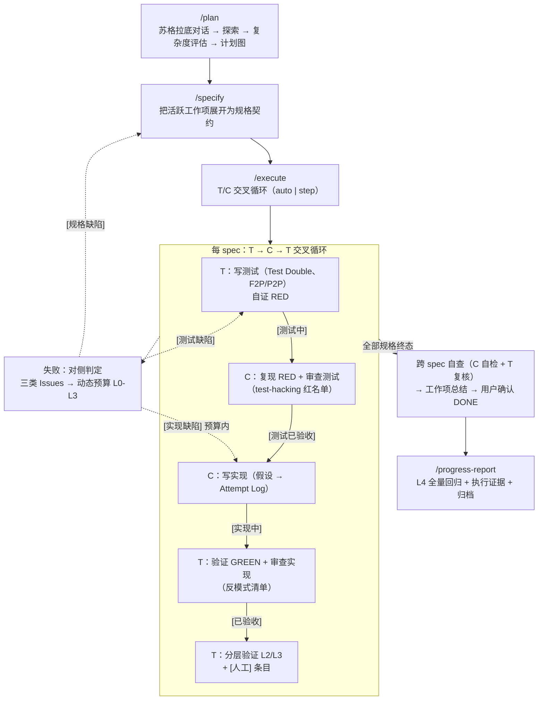

# SpecForge

**面向 AI 编程 agent 的规格驱动 TDD 工作流框架。**

[License: Apache-2.0] [Platform: OpenCode]

> ⚠ **该项目未完工** — 仍在积极开发中，命令行为、目录结构和文档内容均可能发生变更。

---

## 简介

SpecForge 是一套为 AI 编程 agent（[opencode](https://opencode.ai)）设计的**规格驱动 TDD 软件工程流水线**。它将自然语言需求转化为一张**计划图**（工作项为节点），在每个工作项即将执行前把它展开为精确的实现规格，再由 **T（测试）/ C（实现）双视角对抗循环**推进执行——双方互不信任、产物互验，用户担任最终裁判。

**核心理念**：不让单个 AI agent 既设计、编码又自审自判，而是把执行拆为两个对立的视角——**T 视角**写测试并强制 RED，再验证与审查实现（GREEN）；**C 视角**复现 RED 并审查测试，再据此实现。每一份产物都由**对侧**验收——没有独立审查者，也没有自我评价。失败由对侧判定并按三类 Issues 分类，经**动态预算**（L0-L3）路由；返工遵循与规划阶段共用的**统一失效协议**（而非整轮回滚）。

---

## 设计理念

SpecForge 通过「**分离而非信任**」保证质量，建立在三条结构性原则之上：

1. **文件 = agent 上下文隔离** — 每个规划产物是**独立 agent 对话**的主要工作上下文，自包含到「单次对话只读自己需要的文档、写自己的输出」即可独立工作；没有哪个 agent 需要背负整条流水线的上下文。

2. **证据条件化的计划图** — 规划不是固定链条，而是一张**图**：节点是工作项（带依赖边与显式失败路由），结构由证据和复杂度决定，而非预设顺序。`complexity: minimal | task | full` 决定本轮需要几层规划；规格**按需懒展开**（每个工作项执行前才定义），而非一次性全量定义。简单任务自然塌缩为短链——这是设计而非退化。

3. **对抗式 TDD 信任模型** — 执行是 **T/C 双视角交叉循环**，双方互不信任、每份产物由对侧验收：
   - **T 视角（测试方）**：只信规格。写测试与 Test Double，自证 RED（实现前测试必须失败）；然后**验证与审查 C 的实现**（GREEN）——判定 PASS/FAIL 并分类失败。测试代码唯一责任方——`[测试缺陷]` 路由的修复也只由它执行。
   - **C 视角（实现方）**：只信测试。**复现 RED 并审查测试质量**（test-hacking 红名单）；再写实现使测试通过；**永不修改测试代码**——疑似测试错误只能分类路由。实现以假设驱动，写入 Attempt Log。
   - **用户**是最终裁判：裁决 T/C 判定争议、执行 `[人工]` 条目、决定 L3 强制路由、确认工作项 DONE。没有独立的审查命令——审查就是对侧的职责。

---

## 流水线概览



**三个阶段**：

1. **规划（自适应）** — `/plan` 执行苏格拉底四问（为什么 / 隐含假设 / 替代方案 / 边界条件）、探索代码库、评估复杂度（`minimal | task | full`），产出**计划图**（`planning/plan.md`：工作项 + 依赖 + 失败路由 + 每变更类型的验证深度）。`/specify` 把活跃工作项懒展开为规格契约（`planning/specs.md`）——就在它进入执行之前。工作项过大时拆回计划图（运行时分解）。计划修订通过**变更分类 + 影响规则**传播，只失效受影响的工作项。未决问题记入 plan.md 需求节点，须标记 `[resolved]` / `[won't-fix]` 关闭后方可收尾。

2. **执行（T/C 交叉循环）** — `/execute` 一次处理一个工作项：每个规格走 T → C → T 交叉循环。T 写测试（自证 RED）→ C 复现 RED 并审查测试 → C 写实现（假设驱动，Attempt Log 记录）→ T 验证 GREEN 并审查实现。验证分层 L1-L5，深度由变更类型推导。失败由对侧判定、三类分类，经**动态预算**（L0 → L1 Debug 报告 → L2 多候选 → L3 强制路由）路由。全部规格终态后，经**跨 spec 自查 + 用户确认**才标记工作项 DONE。

3. **收尾** — `progress-report` 强制执行验收硬门（L4 全量回归、Goal 可追溯、未决问题全部关闭），聚合**执行证据**（Attempt 次数 / 验证轮数 / 争议次数 / PTS 相位摘要 / F2P-P2P 分轨通过率），然后归档轮次。

非行为变更（chore / docs）走**轻量 spec** 路径：跳过测试撰写，在 `/execute` 内直接实现（C 视角）并经轻量验收（T 视角）。返工由**失败路由协议**驱动——三类 Issues（`[实现缺陷]` / `[测试缺陷]` / `[规格缺陷]`）由对侧判定、路由到**正确的恢复目标**，而非重跑整条链；回退遵循与规划阶段共用的**统一失效协议**。

---

## 关键特性

### 双角色对抗循环

执行是一个循环里的两个对立视角（都在 `/execute` 内）：T 视角写测试并强制 RED，再验证与审查实现；C 视角复现 RED 并审查测试，再据此实现。没有产物由产出方自己验收——验收与判定永远来自**对侧**（C 验收测试、T 验收实现）。用户裁决争议、执行 `[人工]` 项、确认工作项 DONE。

### Attempt Log（假设驱动 GREEN）

每次实现都是显式假设。每次尝试记录在规格的 Attempt Log 区，紧凑三元组：`[假设]` / `[补丁摘要]` / `[结果+证据+诊断]`——假设与补丁由 C 视角填写，**结果/证据/诊断由 T 视角回填**（实现方不自评）。失败方案标记「已试」（负证据），同一方案不得原样重试；L3 升级时负证据精华并入 plan.md。

### 动态预算（L0-L3）

`[实现缺陷]` 返工消耗预算，而非机械数失败次数：

| 级别 | Attempt | 行为 |
| ----- | ------- | ---- |
| L0 | 1 | 常规实现 |
| L1 | 2 | 首次返工：**先产 Debug 报告**（根因 / 证据 / 代码位置），再修复 |
| L2 | 3 | 二次返工：**多候选采样**（2-3 个不同策略；用户选 1 或按验证择优，其余入负证据） |
| L3 | 4 | 三次返工：**强制路由**（/specify 或 /plan 模式 B）——禁止盲目重试 |

总实现 Attempt ≤ 4。`[测试缺陷]` 重写 ≤ 2 次（第 3 次路由 /specify——测试反复失败提示规格歧义），且不消耗实现预算。**振荡检测**：连续 ≥ 2 次相同诊断 → 跳过 L2 直跳 L3。分类前先查上游依赖是否变更——表面报错点可能不是根因点。

### 9 态规格状态机

每个规格用 `[操作类型: 状态]` 格式走严格状态机——**跨视角交接契约语言**：每个视角读规格状态决定行为，状态只由拥有它的视角推进。Retry 计数与预算位置住在 **Attempt Log** 里，不进状态机。

常规轨：`[新增|修改: 已定义]` → `[测试中]` → `[测试已验收]` → `[实现中]` → `[已验收]` → `[已验证]`（终态）；返工态 `[待修复]` 经失败路由协议回环。废弃轨：`[废弃: 待删除]` → `[已解引用]` → `[已删除]`（终态）。共 9 个语义状态，AGENTS.md 权威表按操作类型展开为 11 行（常规轨 7 + 废弃轨 4；「已定义」与「待修复」两轨共用）。完整状态表——含各状态设置者——位于 `/setup` 写入的 `AGENTS.md`（§状态机与记法规范）。

废弃是行为缩减，不是测试先行工作：`/specify` 记录待删目标与 `Depended By`（真实 `grep` 扫描）并把验证清单（定向测试 / 全量构建 / grep 扫描）写入 `Test Cases`；`/execute` 跳过测试撰写，C 视角解引用并移入 `_deprecated/` 后执行清单；`progress-report` 物理删除 `_deprecated/` 并置 `[废弃: 已删除]`。

工作项在 plan.md 中带粗粒度三态标记：`TODO`（未展开）→ `ACTIVE`（规格已定义或执行中）→ `DONE`（全部规格终态）；细节由规格状态机承载。规范的完整状态表位于 `/setup` 写入的 `AGENTS.md`（§状态机与记法规范）。命令文件行文可用竖线简写 `[新增|修改: x]`，但写入 planning/ 文档时必须用完整 `[操作类型: 状态]` 格式。

### 分层验证（L1-L5）

验证深度由变更类型确定性推导（plan.md §变更分类规则表）：

| 层 | 内容 | 执行时机 |
| ---- | ------ | --------- |
| L1 | 规格测试（F2P + P2P） | GREEN 验收（T 视角） |
| L2 | 相关文件测试（Affected Files 内既有测试） | `[已验收]` 后自动附带 |
| L3 | 影响范围回归（工作项 Affects + 依赖链） | 工作项最后一个规格验收后 |
| L4 | 全量回归 | progress-report 收尾 |
| L5 | 行为合理性（[人工] 项 + 交叉审查） | 用户引导执行，结果回写 |

内部实现 → L1-2；API 签名 / 数据结构变更 → L1-3；纯新增 → L1-2；纯删除 → L1-3（含 grep 扫描）；文档/配置 → 轻量 L1。Test Cases 带**双轨角色标注**：`F2P`（问题验证——基态必须失败）/ `P2P`（回归保护——基态必须通过）；每非轻量规格至少 1 个 `[自动化] F2P` 测试。

### 失败路由协议（对侧判定）

失败不再只有单一出口。对侧视角判定 FAIL 时，必须把失败写入规格 `Issues` 字段，格式 `[类型] <失败详情>`，三选一决定返工路由：

| Issues 类型 | 含义 | 路由到 |
| ------------- | ------ | -------- |
| `[实现缺陷]` | 实现违反契约（断言失败且断言期望与规格一致） | C 视角预算内重做（L0-L3） |
| `[测试缺陷]` | 测试代码本身有误（引用规格中不存在的字段、断言与规格文字矛盾等） | T 视角认领重写（≤ 2 次；第 3 次路由 /specify） |
| `[规格缺陷]` | 规格不完整/自相冲突，需要重定义 | `/specify` 重定义（该规格 + 其 Interface 依赖者失效） |

配套纪律：**判定权在对侧**（GREEN 失败由 T 判定、RED 异常由 C 判定）；产出方有权辩护；争议交用户终审。实现方**永不修改测试代码**，测试方永不修改实现代码——疑似错误只能分类路由。分类前先检查上游依赖是否变更（如上游 API 签名变更导致断言失败）——表面报错点可能不是根因点。失败方案标记「已试」，同一方案不得原样重试。

### 统一失效协议（取代整轮回滚，规划与执行共用）

`/plan` 修订计划、`/specify` 受理 `[规格缺陷]` 或 `/execute` 路由 `[规格缺陷]` 时，通过**变更分类 + 影响规则**定位受影响工作项（如 API 签名变更 → 调用方 + 覆写层次；内部实现 → 局部化；纯删除 → grep 实测引用方），然后分级处理：

- **DONE 且文件无重叠** → 不动（已验证状态不因无关修订被破坏）
- **TODO（未展开）** → 直接修订计划，零成本
- **ACTIVE（代码已落地）** → 规格状态重置为初始态、Retry 与实现预算归零、定义文本保留、**Attempt Log 保留为负证据**，工作项标记「待重做」——代码**保留**，由重做覆盖（git restore 仅在用户明确要求或工作树严重污染时执行）

**重叠守卫**保护失效范围之外的已验证规格：与它们 `Affected Files` 共享的文件绝不自动失效，列出供人工精确处理。失败原因记入计划图负证据区与 Attempt Log；同一方案不得原样重试。**同一份协议同时治理规划节点与执行规格——一份协议、两层共用**。

### 轻量规格

并非所有变更都适合测试先行。change_type 为 chore / docs 的规格自动声明轻量；其他类型声明轻量须经用户确认（规格带 `- **轻量**: 是 — <理由>`；agent 不得自行降级）。轻量规格：

- 可省略 Interface（须在 Spec 中说明）；Test Cases 允许仅含 `[人工]` 条目或构建/类型检查清单
- 跳过测试撰写；在 `/execute` 内直接实现（C 视角）
- 验收 = 全量构建 + 类型检查 + 全部 `[人工]` 条目落地为 `✓ PASS`（轻量验收清单，T 视角）
- 经用户确认到 `[已验证]` 终态，与常规规格一致

注：轻量（文档层概念，省 Interface 字段）与 `minimal` 复杂度（流程层概念，`/plan` 省设计层）是正交概念，可叠加。

`[人工]` 验证不是口头承诺：执行侧引导用户逐项执行后，把结果回写 specs.md 对应 Test Cases 条目（`✓ PASS` / `✗ FAIL — <备注>`）；结果未落地状态不得推进到 `[已验证]`。该规则同样适用于常规规格（L5）。

### 变更分类与影响规则 + 验证深度

不设常维护的模块索引，工作项携带小集合变更类型，每类有确定性影响规则**与验证深度**：内部实现（局部化：所在文件 + 直接调用方 → L1-2）、API 签名变更（调用方 + 覆写层次 + 依赖文件 → L1-3）、数据结构变更（读写方 + 持久化 + 序列化 → L1-3）、纯新增（新文件 + 接入点 → L1-2）、纯删除（引用方，grep 实测 → L1-3）、文档/配置（相应文件 → 轻量 L1）。`Affects` 由规则推导而非自由发挥的影响分析；引用始终以真实 grep 扫描核实。

### 跨轮归档

轮次完成时，`progress-report` 先强制执行验收硬门——L4 全量回归 PASS、`# Goal` 可追溯确认、未决问题全部关闭。然后聚合每工作项**执行证据**（Attempt 次数、验证轮数、争议次数、PTS 相位摘要、F2P/P2P 分轨通过率）定位执行层最弱子过程，物理删除 `_deprecated/`、自动生成总结（含 Goal 可追溯清单与执行证据汇总）、把全部规划文件归档到 `planning/archive/`、向 `changelist.md` 追加条目，为下一轮保留历史上下文。（`style_guide.md` 保留在项目根目录供跨轮复用，不归档。）

---

## 安装

```bash
# 克隆到 opencode 配置目录
git clone https://github.com/theLittleStone/SpecForge.git ~/.config/opencode/

# 或只复制 commands
cp -r commands/ ~/.config/opencode/
```

安装后在目标项目中运行 `/setup` 初始化 `AGENTS.md`（所有流水线命令都会先检查它），然后用 `/plan` 启动流水线。

---

## 核心流水线命令

| 命令 | 阶段 | 说明 |
| ------ | ------ | ------ |
| `/plan` | 规划 | 苏格拉底四问（为什么/假设/替代/边界）→ 代码库探索 → 复杂度评估（`minimal`/`task`/`full`）→ 计划图（工作项、依赖、失败路由、验证深度、设计节点（full 复杂度）、延后工作、负证据）。也负责修订现有计划（变更分类 + 影响规则 + 统一失效）。产出 `planning/plan.md` |
| `/specify` | 规划 | 把活跃工作项（首个「Depends On 全部 DONE」的 TODO）展开为规格契约：Spec / Interface / Test Double / Test Cases（F2P/P2P 双轨）/ 上游变更因果链（可选）；过大工作项拆回计划图（运行时分解）；受理 `[规格缺陷]` 重定义（该规格 + Interface 依赖者失效）。产出 `planning/specs.md` |
| `/execute` | **执行** | 唯一执行入口：一次处理一个工作项，T/C 交叉循环（auto / step 模式）。T 写测试（RED）→ C 复现 RED + 审查测试 → C 写实现（假设 → Attempt Log）→ T 验证 GREEN + 审查实现 → 分层验证 L2/L3 → `[人工]` 项 → 跨 spec 自查 → 工作项总结 → 用户确认 DONE。失败处理：对侧判定 + 三类 Issues + 动态预算 L0-L3 + 振荡/停滞守卫 |
| `/progress-report` | 收尾 | 门控 L4 全量回归 + Goal 可追溯 + 未决问题关闭，聚合执行证据（Attempt / 验证轮 / 争议 / PTS / F2P-P2P 通过率），然后物理删除 `_deprecated/`（置 `[废弃: 已删除]`）、归档到 `planning/archive/`、追加 `changelist.md` |

---

## 辅助命令

| 命令 | 说明 |
| ------ | ------ |
| `/setup` | 初始化项目 `AGENTS.md`，写入流水线全局行为约束与 8 节工作流共识（交互协议 / 安全基线 / 执行约束 / 状态机与记法规范 / 失败路由协议 / 统一失效协议 / 人工验证落地规则 / 轻量 spec 规则）。OpenCode 自动注入每个会话；命令引用它而不重复 |

---

## 项目结构

```text
commands/               # 流水线命令定义（Markdown + YAML frontmatter）
  plan.md               # 规划：对话 → 探索 → 评估 → 计划图 / 修订
  specify.md            # 规划：规格懒展开 + [规格缺陷] 重定义
  execute.md            # 执行：T/C 交叉循环（auto | step）
  progress-report.md    # 收尾 & 归档（+ 执行证据）
  setup.md              # AGENTS.md 共识初始化器
  _deprecated/          # 退役制品：10 个旧命令 + 2 个旧 skill
                        # （knowledge-augment、style-resolver），保留供参考
```

---

## License

Apache License 2.0
