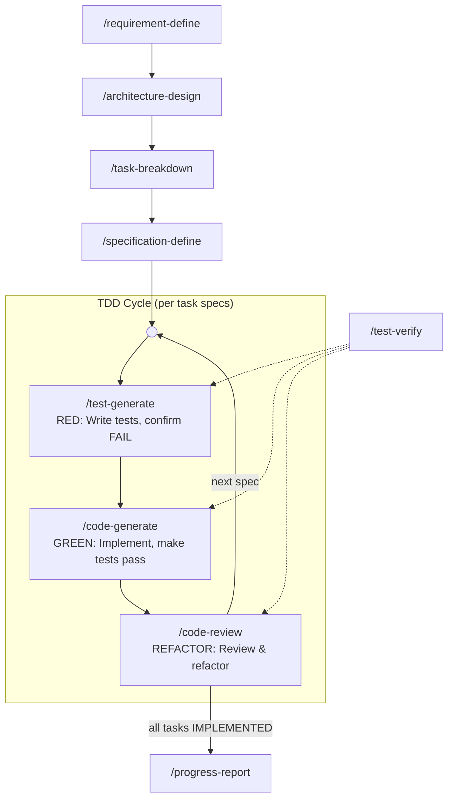

# SpecForge

**A specification-driven TDD workflow framework for AI coding agents**

[License: MIT] [Platform: OpenCode]

> ⚠ **This project is a work in progress** — under active development. Command behavior, directory structure, and documentation are subject to change.

---

## What is SpecForge?

SpecForge is a **specification-driven TDD pipeline** built for AI coding agents (specifically [opencode](https://opencode.ai)). It transforms natural language requirements into precise implementation specs, then drives the agent through a test-first engineering workflow with strict state gating.

Instead of letting an AI agent code directly, SpecForge enforces a disciplined cycle: define the `Interface` contract → generate tests → confirm the tests fail (RED) → write code to pass them (GREEN) → review and refactor (REFACTOR). Every line of code is traceable back to a spec, verified by tests, and safely rollbackable.

---

## Pipeline Overview



**Linear phase**: `requirement-define → architecture-design → task-breakdown → specification-define`. Four sequential planning stages, each producing a document for the next.

**TDD cycle**: `test-generate → code-generate → code-review` forms a loop. Each spec in the current task runs through RED → GREEN → REFACTOR before moving to the next spec. When all specs in a task reach terminal state, code-review marks the task `IMPLEMENTED`, and specification-define can process the next task.

**test-verify** (dotted lines) is a shared test runner reused across all three TDD phases, interpreting PASS/FAIL according to the calling context.

---

## Key Features

### Full TDD Pipeline

RED (write tests, confirm FAIL) → GREEN (implement, make tests pass) → REFACTOR (review & refactor). Each phase has strict state guards — a FAIL at any stage blocks progression and prompts for repair.

### Spec-Driven Development

Every change starts from a precise `Interface` contract + `Test Double` strategy + `Test Cases` list. Test cases are split into `[automation]` (code assertions) and `[manual]` (interactive/visual verification), ensuring complete coverage.

### Test Double Dual-Layer Model

Specs involving external boundaries (APIs, databases, filesystem, email, time/randomness) automatically require a Test Double design:

- **Layer 1**: Test Double → automated tests (fast, deterministic core logic coverage)
- **Layer 2**: Manual testing → visual/interactive/real integration checks (residual gaps Test Doubles can't reach)

The two layers are additive, not mutually exclusive.

### 16-State Spec Machine

Each spec flows through a strict state machine using the `[Operation: State]` format:

| State Label | Set By | Meaning |
|-------------|--------|---------|
| `[新增: 已定义]` | specification-define | Spec defined, ready for test generation |
| `[新增: 测试已生成]` | test-generate | Tests generated and confirmed RED |
| `[新增: 已实现]` | code-generate | Code implemented, awaiting verification |
| `[新增: 已测试]` | test-verify | Tests passed, awaiting review |
| `[新增: 待修复]` | test-verify | Tests failed, needs repair |
| `[新增: 已验证]` | code-review | Reviewed and verified (terminal) |
| `[修改: 已定义]` | specification-define | Modification spec defined |
| `[修改: 测试已生成]` | test-generate | Modification tests generated and confirmed RED |
| `[修改: 已实现]` | code-generate | Modification implemented |
| `[修改: 已测试]` | test-verify | Modification tests passed |
| `[修改: 待修复]` | test-verify | Modification tests failed |
| `[修改: 已验证]` | code-review | Modification reviewed and verified (terminal) |
| `[废弃: 待删除]` | specification-define | Spec defined (with removal target and `Depended By`), awaiting de-reference |
| `[废弃: 已解引用]` | code-generate | Referrers all removed, code moved to `_deprecated/`, targeted tests + full build pass |
| `[废弃: 待修复]` | test-verify | De-reference verification failed, repair affected modules and retry |
| `[废弃: 已删除]` | progress-report | Code physically deleted from `_deprecated/` (progress-report closeout), terminal |

### Code-Aware Rollback

When any upstream command (requirement-define / architecture-design / task-breakdown / specification-define) modifies a document, it automatically scans for downstream code that has already been written. If found, it generates precise `git restore --source <baseline>` instructions (baseline = the git HEAD recorded in requirement.md frontmatter at round start) — protecting the codebase from accidental inconsistency between planning documents and implementation.

### Socratic Requirements Gathering

`requirement-define` does not blindly accept user descriptions. Instead, it asks "why", challenges implicit assumptions, explores alternatives, and exhausts edge cases before drafting. Only after reaching deep consensus with the user does it produce the requirement document.

### Recursive Completion Propagation

When `code-review` completes a spec, it walks upward: checks whether all specs under the current task have reached terminal state. If yes, it marks the task `[IMPLEMENTED]`. When all tasks are done, it prompts the user to run `progress-report` for archival.

### Cross-Round Archival

When a round completes, `progress-report` auto-generates a summary, archives all planning files to `planning/archive/`, appends an entry to `changelist.md`, and preserves historical context for the next round.

---

## Installation

```bash
# Clone into opencode config directory
git clone https://github.com/<your-org>/specforge.git ~/.config/opencode/

# Or just copy the commands and skills
cp -r commands/ skills/ ~/.config/opencode/
```

After installation, run `/requirement-define` in opencode to start the pipeline.

---

## Core Pipeline Commands

| Command | Stage | Description |
|---------|-------|-------------|
| `/requirement-define` | Planning | Socratic dialogue to define goals, scope, constraints, and open questions. Produces `planning/requirement.md` |
| `/architecture-design` | Planning | Design architecture changes, impact analysis, and Test Double strategy. Produces `planning/architecture.md` |
| `/task-breakdown` | Planning | Break architecture into a DAG of executable tasks with dependencies. Produces `planning/tasks.md` |
| `/specification-define` | Planning | Define Interface, Test Double, and Test Cases for each task. Produces `planning/specifications.md` |
| `/test-generate` | **RED** | Generate test code from specs, run to confirm FAIL. Generate Test Double code. Assembles `[manual]` items into a checklist |
| `/code-generate` | **GREEN** | Read test code to understand expected behavior, implement to pass tests. Guides `[manual]` verification step by step |
| `/code-review` | **REFACTOR** | Code review + refactoring + regression testing. Rolls back on regression failure. Propagates completion upward on success |
| `/test-verify` | Verify | Shared test runner reused by test-generate / code-generate / code-review. Interprets PASS/FAIL based on calling context |
| `/progress-report` | Close | Aggregate progress, archive to `planning/archive/`, append to `changelist.md` |

---

## Auxiliary Commands

| Command | Description |
|---------|-------------|
| `/deep-debug` | System-level bug investigation using hypothesis-driven analysis of code, tests, and documentation |
| `/explain-to-me` | Explain code, architecture, or technical concepts by synthesizing local code with web information |
| `/setup` | Initialize `AGENTS.md` with pipeline-wide behavior constraints |

---

## Built-in Skills

SpecForge ships with two opencode skills that are invoked automatically during the pipeline:

### knowledge-augment

Fills knowledge gaps about programming languages, frameworks, and libraries with concise examples and common pitfalls. Called on-demand during requirement analysis, specification definition, code generation, and debugging.

### style-resolver

Auto-detects the project's language and framework, then generates `style_guide.md` based on existing code conventions or community standards. Called automatically by code-generate and code-review to ensure consistent code style.

---

## Project Structure

```
commands/               # 12 pipeline command definitions (Markdown + YAML frontmatter)
  architecture-design.md
  code-generate.md
  code-review.md
  deep-debug.md
  explain-to-me.md
  progress-report.md
  requirement-define.md
  setup.md
  specification-define.md
  task-breakdown.md
  test-generate.md
  test-verify.md
skills/                 # Agent auxiliary skills
  knowledge-augment/
    SKILL.md
  style-resolver/
    SKILL.md
    style-guide-example.md
config.json             # OpenCode provider config (example template)
package.json            # OpenCode plugin dependency
```

---

## License

Apache License 2.0
