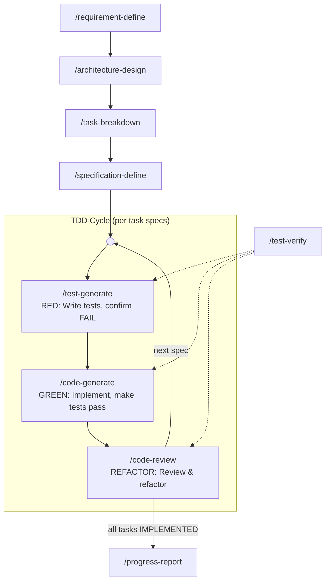

# SpecForge

**A specification-driven TDD workflow framework for AI coding agents**

[License: Apache-2.0] [Platform: OpenCode]

> ⚠ **This project is a work in progress** — under active development. Command behavior, directory structure, and documentation are subject to change.

---

## What is SpecForge?

SpecForge is a **specification-driven TDD pipeline** built for AI coding agents (specifically [opencode](https://opencode.ai)). It transforms natural language requirements into precise implementation specs, then drives separate agent conversations through a test-first engineering workflow with strict state gating.

Instead of letting a single AI agent design, code, and grade itself, SpecForge splits responsibilities across multiple agents that distrust each other: define the `Interface` contract → generate tests → confirm the tests fail (RED) → write code to pass them (GREEN) → review and refactor (REFACTOR). Every line of code is traceable back to a spec, verified by a neutral test runner, and safely rollbackable.

---

## Design Philosophy

SpecForge guarantees quality through **separation, not trust**, built on three structural principles:

1. **Files as agent context isolation** — Each planning stage produces its own document. Every document is the primary working context of a **separate agent conversation**, self-contained enough that a conversation only needs to read the previous layer and write its own output. No agent carries the entire pipeline context.

2. **Progressive refinement** — The planning layers are not copies of each other; each is a **more concrete rewriting** of the previous one: `Goal & Scope → Changes & Design → Executable Tasks → Precise Interface Contracts & Test Cases`. Requirements get progressively pinned down at every layer.

3. **Adversarial TDD trust model** — In the programming phase, test / code / review are designed to be executed by **different agents that mutually distrust each other**:
   - **Test agent** (`/test-generate`): trusts only the spec. Writes tests and Test Doubles, and forces RED (tests must fail before implementation). It is the **sole owner of test code** — `[test-defect]` repairs are routed back to it as well.
   - **Code agent** (`/code-generate`): trusts only the tests. Reads them to understand expected behavior, then implements; **never modifies test code** — suspected test errors are only classified and routed.
   - **Review agent** (`/code-review`): audits both code and test quality, refactors, and propagates completion upward.
   - **Neutral verifier** (`/test-verify`): generates no code; judges only test results and updates spec states. Neither side can grade itself. On FAIL it classifies Issues into three types per the failure routing protocol.
   - **The user** is the final judge, verifying `[manual]` items that automation cannot reach; results are written back to specs.md by code-generate.

---

## Pipeline Overview



**Three phases**:

1. **Planning (linear)** — `requirement-define → architecture-design → task-breakdown → specification-define`. Four sequential stages, each producing a self-contained document for the next. A single conversation reads only the previous layer and writes its own, keeping agent context small.

2. **Programming (TDD cycle)** — `test-generate → code-generate → code-review` forms the RED → GREEN → REFACTOR loop. Each spec in the current task runs through the whole loop before the next spec. When all specs in a task reach terminal state, code-review marks the task `IMPLEMENTED`, and specification-define can process the next task.

3. **Closeout** — `progress-report` enforces hard acceptance gates (full regression, Goal traceability, closed Open Questions), then archives the round.

**test-verify** (dotted lines) is a shared **neutral test runner** reused across all three TDD phases, interpreting PASS/FAIL according to the calling context. It generates no code and advances spec states solely from test results — neither the test agent nor the code agent can grade itself. On FAIL it classifies Issues into three types per the failure routing protocol. It also powers `code-review`'s impact-scope regression (including the pre-refactor baseline run) and `progress-report`'s full regression.

Non-behavioral changes (chore / docs) take the **lightweight spec** path: RED is skipped, and after implementation the spec goes through `/test-verify`'s lightweight acceptance and `/code-review` audit, sharing the same terminal states. Rework is driven by the **failure routing protocol** — the three-class Issues (`[实现缺陷]` / `[测试缺陷]` / `[规格缺陷]`) route back to the implementation / test / spec stage respectively, giving both test errors and spec errors a defined exit.

---

## Key Features

### Full TDD Pipeline

RED (write tests, confirm FAIL) → GREEN (implement, make tests pass) → REFACTOR (review & refactor). Each phase has strict state guards — a FAIL at any stage blocks progression and prompts for repair.

### Adversarial TDD Roles

test / code / review are intended to be executed by **different agents that distrust each other**: the test agent writes tests that must fail (RED), the code agent implements only to satisfy them (GREEN), the review agent audits both (REFACTOR), and `/test-verify` grades solely by test results. `[manual]` items are judged by the user as the final authority.

### Spec-Driven Development

Every change starts from a precise `Interface` contract + `Test Double` strategy + `Test Cases` list. Test cases are split into `[automation]` (code assertions) and `[manual]` (interactive/visual verification), ensuring complete coverage.

### Test Double Dual-Layer Model

Specs involving external boundaries (APIs, databases, filesystem, email, time/randomness) automatically require a Test Double design:

- **Layer 1**: Test Double → automated tests (fast, deterministic core logic coverage)
- **Layer 2**: Manual testing → visual/interactive/real integration checks (residual gaps Test Doubles can't reach)

The two layers are additive, not mutually exclusive.

### 16-State Spec Machine

Each spec flows through a strict state machine using the `[Operation: State]` format. The state machine is the **inter-agent contract language**: each agent reads a spec's state to decide what to do and how to verify, then hands off by advancing it. States are advanced only by the command that owns them.

| State Label | Set By | Meaning |
|-------------|--------|---------|
| `[新增: 已定义]` | specification-define | Spec defined, ready for test generation |
| `[新增: 测试已生成]` | test-generate | Tests generated and confirmed RED |
| `[新增: 已实现]` | code-generate | Code implemented, awaiting verification |
| `[新增: 已测试]` | test-verify | Tests passed, awaiting review |
| `[新增: 待修复]` | test-verify / code-review | Verification failed, rework via failure routing protocol |
| `[新增: 已验证]` | code-review | Reviewed and verified (terminal) |
| `[修改: 已定义]` | specification-define | Modification spec defined |
| `[修改: 测试已生成]` | test-generate | Modification tests generated and confirmed RED |
| `[修改: 已实现]` | code-generate | Modification implemented |
| `[修改: 已测试]` | test-verify | Modification tests passed |
| `[修改: 待修复]` | test-verify / code-review | Modification verification failed, rework via failure routing protocol |
| `[修改: 已验证]` | code-review | Modification reviewed and verified (terminal) |
| `[废弃: 待删除]` | specification-define | Spec defined (with removal target and `Depended By`), awaiting de-reference |
| `[废弃: 已解引用]` | code-generate | Referrers all removed, code moved to `_deprecated/`, targeted tests + full build pass |
| `[废弃: 待修复]` | test-verify / code-review | De-reference verification failed, rework via failure routing protocol |
| `[废弃: 已删除]` | progress-report | Code physically deleted from `_deprecated/` (progress-report closeout), terminal |

Lightweight specs share this state machine with regular specs, skipping only the test-generate phase (see "Lightweight Specs"). The canonical 16-state table lives in the `AGENTS.md` written by `/setup` (§ State Machine & Notation); each command's state-filter rules live in its own command file. Command files use the pipe shorthand `[新增|修改: x]` for parallel enumeration, but the full `[OperationType: State]` form is mandatory when writing into planning/ documents.

### Failure Routing Protocol (Issues Three-Class)

Failures no longer have a single exit. When test-verify / code-review judge FAIL, they must write the failure into the spec's `Issues` field as `[type] <detail>` with one of three classifications, deciding the rework route:

| Issues Type | Meaning | Routed To |
|-------------|---------|-----------|
| `[实现缺陷]` | Implementation violates the contract (assertion fails and the assertion matches the spec) | `/code-generate` fixes the implementation |
| `[测试缺陷]` | The test code itself is wrong (references fields not in the spec, assertion contradicts spec text, etc.) | `/test-generate` fixes the test |
| `[规格缺陷]` | The spec is incomplete/self-contradictory and needs redefinition | `/specification-define` (whole-task rollback, then redefine) |

Accompanying discipline: the code agent and review agent **never modify test code** (`/test-generate` is the sole owner); when `Retry Count ≥ 3`, blind retries are forbidden — one of the three routes must be chosen.

### Lightweight Specs

Not every change suits test-first. Specs with `change_type` of `chore` / `docs` are declared lightweight automatically; other types may be declared lightweight after user confirmation (spec carries `- **轻量**: 是 — <reason>`; the agent must not self-downgrade). Lightweight specs:

- May omit Interface (must be explained in Spec); Test Cases may contain only `[manual]` items or a build/typecheck checklist
- Skip test-generate; `/code-generate` implements directly
- GREEN acceptance = full build + typecheck + all `[manual]` items landed as `✓ PASS` (run by the `/test-verify` lightweight checklist)
- Then go through `/code-review` to the `[已验证]` terminal state, same as regular specs

### Manual Verification Persistence

`[manual]` tests are not verbal: after code-generate walks the user through each item, it must write the result back to the Test Cases entry in specs.md (`✓ PASS` / `✗ FAIL — <note>`). State must not advance until results are landed; code-review uses these landed marks as the sole cross-session evidence of manual acceptance.

### Deprecated Code Lifecycle

Removal is a behavior reduction, not test-first work. Deprecated specs flow through a dedicated lifecycle:

1. **Define**: `specification-define` records the removal target and its `Depended By` (derived from the `# Dependency Index`, verified by a real `grep` scan), and writes the verification checklist (targeted tests / full build / grep scan) into `Test Cases`
2. **Skip test generation**: `test-generate` skips deprecated specs entirely — no tests or RED confirmation
3. **De-reference & move**: `code-generate` removes all references, moves the code into `_deprecated/` (excluded from build/test config), syncs `# Dependency Index` / `Depended By`, then `test-verify` runs the verification checklist
4. **Closeout**: `progress-report` physically deletes `_deprecated/` and sets `[废弃: 已删除]`

### Dependency Index

`architecture-design` maintains a module-level bidirectional reference index (`# Dependency Index`: Module / Depends On / Depended By) in `architecture.md`, kept in sync with every change. Modules slated for removal must list all their referrers under `Depended By` — this drives the de-reference work in `code-generate` and the physical-deletion decision in `progress-report`. For deprecated specs, the authoritative `Depended By` comes from an actual `grep` scan of the codebase, not the index alone.

### Code-Aware Rollback (Unified Rollback Protocol + Overlap Guard)

When any upstream command (requirement-define / architecture-design / task-breakdown / specification-define) modifies a document, it automatically scans for downstream code that has already been written. If found, it applies the unified **rollback protocol** (single-sourced in AGENTS.md):

- **Scope**: requirement / architecture / task-level edits = all specs of the round; specification-level redefinition (including `[规格缺陷]` routing) = all specs of the current task (whole-task rollback)
- **Instructions**: aggregates `Affected Files` of specs in scope and emits precise `git restore --source <baseline>` instructions (baseline = the git HEAD recorded in requirement.md frontmatter at round start)
- **Overlap guard**: intersects the rollback set with `Affected Files` of all `[新增|修改: 已验证]` / `[废弃: 已解引用]` specs **outside** the scope; overlapping files are **never auto-restored** (they carry verified work) — they are listed for precise manual reversion and re-verified later by code-review's impact-scope regression, protecting already-accepted features from collateral damage
- **State reset**: specs in scope reset to initial states (`[已定义]` / `[废弃: 待删除]`); task markers reset by level — requirement / architecture / task-level rollback resets all tasks to `[TODO]` (descriptions preserved, re-verified on re-run, existing specs revised in place rather than re-created), specification-level rollback (whole task) keeps `[DEFINED]`. planning/ documents are preserved
- **Special cases**: de-referenced code (`[废弃: 已解引用]`) additionally requires deleting `_deprecated/` and its moved copies; physically deleted code (`[废弃: 已删除]`) must be recovered from git history (`git log --diff-filter=D`)

### Socratic Requirements Gathering

`requirement-define` does not blindly accept user descriptions. Instead, it asks "why", challenges implicit assumptions, explores alternatives, and exhausts edge cases before drafting. Only after reaching deep consensus with the user does it produce the requirement document.

### Recursive Completion Propagation

When `code-review` completes a spec, it walks upward: checks whether all specs under the current task have reached terminal state. If yes, it marks the task `[IMPLEMENTED]`. When all tasks are done, it prompts the user to run `progress-report` for archival. Removal specs reach their terminal state at `[废弃: 已解引用]` — physical deletion is deferred to the `progress-report` closeout.

### Cross-Round Archival

When a round completes, `progress-report` first enforces hard acceptance gates — full regression PASS, `# Goal` traceability confirmed, and all `# Open Questions` closed. It then physically deletes `_deprecated/`, auto-generates a summary, archives all planning files (plus `style_guide.md`) to `planning/archive/`, appends an entry to `changelist.md`, and preserves historical context for the next round.

---

## Installation

```bash
# Clone into opencode config directory
git clone https://github.com/<your-org>/specforge.git ~/.config/opencode/

# Or just copy the commands and skills
cp -r commands/ skills/ ~/.config/opencode/
```

After installation, run `/setup` in the target project to initialize `AGENTS.md` (every pipeline command checks for it first), then start the pipeline with `/requirement-define`.

---

## Core Pipeline Commands

| Command | Stage | Description |
|---------|-------|-------------|
| `/requirement-define` | Planning | Socratic dialogue to define goals, scope, constraints, and open questions. Supports feature/enhancement/refactor/bugfix/removal/chore/docs. Produces `planning/requirement.md` |
| `/architecture-design` | Planning | Design architecture changes, impact analysis, and Test Double strategy. Produces `planning/architecture.md` |
| `/task-breakdown` | Planning | Break architecture into a DAG of executable tasks with dependencies. Produces `planning/tasks.md` |
| `/specification-define` | Planning | Define Interface, Test Double, and Test Cases for each task (one integrated proposal + one confirmation per spec); declares lightweight specs; handles `[规格缺陷]` routing (whole-task rollback + redefine). Produces `planning/specifications.md` |
| `/test-generate` | **RED** (test agent) | Generate test code from specs, run to confirm FAIL. Generate Test Double code. Assembles `[manual]` items into a checklist. The **sole owner of test code** — repairs `[测试缺陷]`-routed tests. Skips deprecated and lightweight specs |
| `/code-generate` | **GREEN** (code agent) | Read test code to understand expected behavior, implement to pass tests; lightweight specs implemented directly. Guides `[manual]` verification and writes results back to specs.md. Never modifies test code; failures routed by the three-class Issues protocol |
| `/code-review` | **REFACTOR** (review agent) | Code review + refactoring + regression testing. Runs a **baseline regression before any refactor** (even with zero refactor items); runs impact-scope regression after each refactor, rolls back on failure. Reviews test code quality (classify-and-route only, never edits tests). Verifies `[manual]` completion via landed marks in specs.md. Propagates completion upward on success |
| `/test-verify` | Verify (neutral) | Neutral test runner reused by test-generate / code-generate / code-review / progress-report. Interprets PASS/FAIL by calling context; classifies failures as assertion vs error; on FAIL writes three-class Issues with routing advice; executes impact-scope regression (code-review) and full regression (progress-report); runs the deprecated verification checklist (targeted tests + full build + grep scan); runs the lightweight acceptance checklist (build + typecheck + manual-landing check) |
| `/progress-report` | Close | Gate on full regression + Goal traceability + closed Open Questions, then physically delete `_deprecated/` (setting `[废弃: 已删除]`), archive to `planning/archive/`, append to `changelist.md` |

---

## Auxiliary Commands

| Command | Description |
|---------|-------------|
| `/deep-debug` | System-level bug investigation using hypothesis-driven analysis of code, interfaces, and tests |
| `/explain-to-me` | Explain code, architecture, or technical concepts by synthesizing local code with web information |
| `/setup` | Initialize project `AGENTS.md` with pipeline-wide behavior constraints and the 8-section workflow consensus (interaction protocol / safety baseline / execution constraints / state machine & notation / failure routing protocol / unified rollback protocol / manual-landing rule / lightweight spec rule). OpenCode auto-injects it into every session; commands reference it instead of duplicating |

---

## Built-in Skills

SpecForge ships with two opencode skills that the pipeline invokes on demand:

### knowledge-augment

Fills knowledge gaps about programming languages, frameworks, and libraries with concise examples and common pitfalls. Invoked on demand — explicitly referenced by deep-debug / explain-to-me, and the AGENTS.md safety baseline lets any command call it.

### style-resolver

Auto-detects the project's language and framework, then generates `style_guide.md` based on existing code conventions or community standards. Invoked by test-generate / code-generate when `style_guide.md` is missing (code-review only reads the existing `style_guide.md` as audit basis; it never generates one) to ensure consistent code style.

---

## Project Structure

```
commands/               # 12 pipeline command definitions (Markdown + YAML frontmatter)
  architecture-design.md
  code-generate.md
  code-review.md
  deep-debug.md
  explain-to-me.md
  progress-report.md
  requirement-define.md
  setup.md
  specification-define.md
  task-breakdown.md
  test-generate.md
  test-verify.md
skills/                 # Agent auxiliary skills
  knowledge-augment/
    SKILL.md
  style-resolver/
    SKILL.md
    style-guide-example.md
```

---

## License

Apache License 2.0
