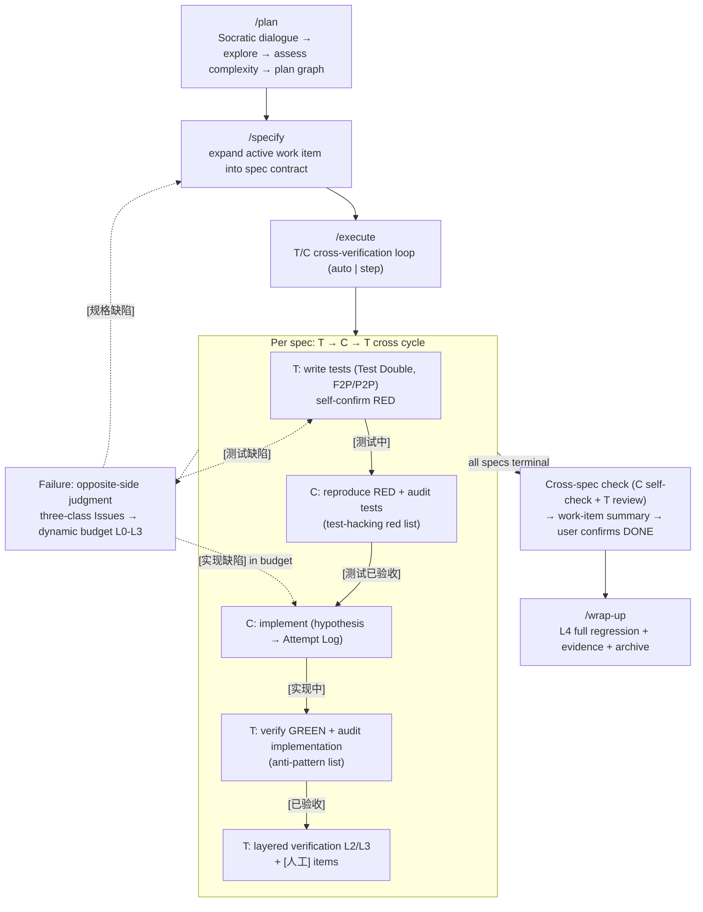

# SpecForge

**A specification-driven TDD workflow framework for AI coding agents.**

[License: Apache-2.0] [Platform: OpenCode]

> ⚠ **This project is a work in progress** — under active development. Command behavior, directory structure, and documentation are subject to change.

---

## What is SpecForge?

SpecForge is a **specification-driven TDD pipeline** built for AI coding agents (specifically [opencode](https://opencode.ai)). It transforms natural language requirements into a **plan graph** of work items, expands each work item into a precise implementation spec just before execution, then drives execution through a **two-role adversarial loop** — a Test agent (T) and a Code agent (C) that distrust each other and cross-verify every artifact, with the user as final judge.

Instead of letting a single AI agent design, code, and grade itself, SpecForge separates the workflow into two opposing roles: the **T view** writes tests and forces them RED, then verifies and audits the implementation (GREEN); the **C view** reproduces RED and audits the tests, then implements against them. Every artifact is accepted by the **opposite side** — no independent reviewer, no self-grading. Failures are classified by the opposite side and routed through a **dynamic budget** (L0–L3); rework follows the **unified invalidation protocol** shared with the planning phase instead of whole-round rollback.

---

## Design Philosophy

SpecForge guarantees quality through **separation, not trust**, built on three structural principles:

1. **Files as agent context isolation** — Each planning artifact is the primary working context of a **separate agent conversation**, self-contained enough that a conversation only needs to read the documents it needs and write its own output. No agent carries the entire pipeline context.

2. **Evidence-conditioned plan graph** — Planning is not a fixed chain but a **graph**: nodes are work items (with dependency edges and explicit failure routes), and structure is decided by evidence and complexity, not by a preset sequence. `complexity: minimal | task | full` determines how many planning layers the round needs; specs are expanded **lazily** (per work item, right before execution) instead of all upfront. Simple tasks naturally collapse to a short chain — that is by design, not degradation.

3. **Adversarial TDD trust model** — Execution is a **two-role cross-verification loop** in which T and C distrust each other and each artifact is accepted by the opposite side:
   - **T view (Test Agent)**: trusts only the spec. Writes tests and Test Doubles, self-confirms RED (tests must fail on unimplemented code), then **verifies and audits C's implementation** (GREEN) — judging PASS/FAIL and classifying failures. Sole owner of test code: `[测试缺陷]` repairs route back to it.
   - **C view (Code Agent)**: trusts only the tests. **Reproduces RED and audits T's test quality** (test-hacking red list), then implements to satisfy them; **never modifies test code** — suspected test errors are only classified and routed. Writes implementation attempts as hypotheses into the Attempt Log.
   - **The user** is the final judge: adjudicates disputes between T and C, executes `[人工]` items, decides L3 routing, and confirms work-item completion (DONE). There is no separate review agent — review is the opposite side's job.

---

## Pipeline Overview



**Three phases**:

1. **Planning (adaptive)** — `/plan` runs the Socratic dialogue (why / assumptions / alternatives / boundaries), explores the codebase, assesses complexity (`minimal | task | full`), and produces a **plan graph** (`planning/plan.md`: work items with dependencies, failure routes, verification depth per change type). `/specify` expands the active work item into a spec contract (`planning/specs.md`) lazily — right before it enters execution. When a work item turns out too large, it is split and written back into the graph (runtime decomposition). Plan revisions propagate through **change classification + impact rules** and invalidate only affected work items. Unresolved questions are recorded in the requirement node of plan.md and must be closed (`[resolved]` / `[won't-fix]`) before the round can be closed.

2. **Execution (T/C cross-verification loop)** — `/execute` processes exactly one work item: each spec runs the T → C → T cycle. T writes tests (self-confirming RED), C reproduces RED and audits the tests, C implements (hypothesis-driven, recorded in the Attempt Log), T verifies GREEN and audits the implementation. Verification is layered L1–L5 with depth derived from the change type. Failures are judged by the opposite side, classified into three classes, and routed through a **dynamic budget** (L0 → L1 debug report → L2 multi-candidate → L3 forced routing). When all specs reach terminal state, the work item is closed via a cross-spec check and **user confirmation** before marking DONE.

3. **Closeout** — `wrap-up` enforces hard acceptance gates (L4 full regression, Goal traceability, closed unresolved questions), aggregates **execution evidence** (attempts / verification rounds / disputes / PTS phase summaries / F2P-P2P pass rates), then archives the round.

Non-behavioral changes (chore / docs) take the **lightweight spec** path: RED is skipped and the spec is implemented directly inside `/execute` (C view) then accepted via the lightweight checklist (T view). Rework is driven by the **failure routing protocol** — three-class Issues (`[实现缺陷]` / `[测试缺陷]` / `[规格缺陷]`) judged by the opposite side and routed to the **right recovery target** rather than re-running the whole chain; rollback follows the **unified invalidation protocol** shared with the planning phase.

---

## Key Features

### Two-Role Adversarial Loop

Execution is a single loop with two opposing views inside `/execute`: the T view writes tests and forces RED, then verifies and audits the implementation; the C view reproduces RED and audits the tests, then implements to satisfy them. No artifact is accepted by its producer — acceptance and judgment always come from the **opposite side** (the C view accepts tests, the T view accepts implementations). The user adjudicates disputes, runs `[人工]` items, and confirms work-item DONE.

### Attempt Log (Hypothesis-Driven GREEN)

Each implementation is an explicit hypothesis. Every attempt is recorded in the spec's Attempt Log as a compact triple: `[假设]` hypothesis / `[补丁]` patch summary / `[结果+证据+诊断]` result & evidence & diagnosis — with the hypothesis and patch written by the C view and result/evidence/diagnosis **filled in by the T view** (no self-evaluation). Failed attempts are marked "tried" (negative evidence) and must never be retried verbatim; on L3 escalation the distilled negative evidence is merged into plan.md.

### Dynamic Budget (L0–L3)

`[实现缺陷]` rework consumes a budget instead of counting retries blindly:

| Level | Attempt | Behavior |
| ----- | ------- | -------- |
| L0 | 1 | Regular implementation |
| L1 | 2 | First rework: **Debug report first** (root cause / evidence / code locations), then fix |
| L2 | 3 | Second rework: **multi-candidate sampling** (2–3 different strategies; user picks one or best-by-validation wins; the rest become negative evidence) |
| L3 | 4 | Third rework: **forced routing** (`/specify` or `/plan` mode B) — blind retries forbidden |

Total implementation attempts ≤ 4. `[测试缺陷]` rework is capped at 2 (the 3rd routes to `/specify` — repeated test failure suggests spec ambiguity) and never consumes the implementation budget. **Oscillation detection**: two consecutive identical diagnoses skip L2 and jump straight to L3. Failures are classified **after checking upstream dependencies** — the surface failure point may not be the root cause.

### 9-State Spec Machine

Each spec flows through a strict state machine using the `[Operation: State]` format — the **inter-agent contract language**: each view reads a spec's state to decide what to do, and states are advanced only by the view that owns them. Retry counters and budget positions live in the **Attempt Log**, not in the state machine.

Normal track: `[新增|修改: 已定义]` → `[测试中]` → `[测试已验收]` → `[实现中]` → `[已验收]` → `[已验证]` (terminal); the rework state `[待修复]` loops back via the failure routing protocol. Deprecation track: `[废弃: 待删除]` → `[已解引用]` → `[已删除]` (terminal). Nine semantic states — the canonical table in AGENTS.md expands them by operation type into 11 rows (7 regular-track + 4 deprecation-track; `已定义` and `待修复` are shared across tracks). The canonical table — including who sets each state — lives in the `AGENTS.md` written by `/setup` (§ State Machine & Notation).

Removal is behavior reduction, not test-first work: `/specify` records the removal target and its `Depended By` (real `grep` scan) and writes a verification checklist (targeted tests / full build / grep scan) into `Test Cases`; `/execute` skips test writing, the C view de-references and moves the code into `_deprecated/`, then runs the checklist; `wrap-up` physically deletes `_deprecated/` and sets `[废弃: 已删除]`.

Work items carry a coarse three-state marker in plan.md: `TODO` (not yet expanded) → `ACTIVE` (spec defined or executing) → `DONE` (all specs terminal); details live in the spec state machine. The canonical table lives in the `AGENTS.md` written by `/setup` (§ State Machine & Notation); each command's state-filter rules live in its own command file. The pipe shorthand `[新增|修改: x]` is allowed inside command files but the full `[OperationType: State]` form is mandatory when writing into planning/ documents.

### Layered Verification (L1–L5)

Verification depth is derived deterministically from the change type (plan.md §变更分类规则表):

| Layer | Content | When |
| ----- | ------- | ---- |
| L1 | Spec tests (F2P + P2P) | GREEN acceptance (T view) |
| L2 | Related-file tests (existing tests in `Affected Files`) | Auto-run after `[已验收]` |
| L3 | Impact-scope regression (work-item `Affects` + dependency chain) | After the last spec of the work item |
| L4 | Full regression | `wrap-up` closeout |
| L5 | Behavioral sanity (`[人工]` items + cross review) | User-guided, results written back |

Internal implementation → L1-2; API signature / data structure change → L1-3; pure addition → L1-2; pure removal → L1-3 (incl. grep scan); docs/config → lightweight L1. Test Cases carry a dual-track role annotation: **F2P** (problem verification — must fail on baseline) / **P2P** (regression protection — must pass on baseline); every non-lightweight spec requires at least one `[自动化] F2P` test.

### Failure Routing Protocol (Opposite-Side Judgment)

Failures no longer have a single exit. When the opposite side judges FAIL, it writes the failure into the spec's `Issues` field as `[类型] <detail>` with one of three classifications:

| Issues Type | Meaning | Routed To |
| ------------- | --------- | ----------- |
| `[实现缺陷]` | Implementation violates the contract (assertion fails and the assertion matches the spec) | C view rework within the dynamic budget (L0–L3) |
| `[测试缺陷]` | The test code itself is wrong (references fields not in the spec, assertion contradicts spec text, etc.) | T view rewrites the tests (≤ 2; the 3rd routes to `/specify`) |
| `[规格缺陷]` | The spec is incomplete/self-contradictory and needs redefinition | `/specify` redefines the spec (single spec + its Interface dependents invalidated) |

Accompanying discipline: **judgment belongs to the opposite side** (T judges GREEN failures, C judges RED anomalies); the producer may defend; disputes go to the user. The C view **never modifies test code**; the T view never modifies implementation code — suspected errors are only classified and routed. Before classifying, check whether an upstream dependency changed — the surface failure point may not be the root cause. Failed attempts are marked "tried" and never retried verbatim.

### Unified Invalidation Protocol (replaces whole-round rollback, shared with planning)

When `/plan` revises the plan, `/specify` handles a `[规格缺陷]`, or `/execute` routes one, affected work items are located via **change classification + impact rules**, then handled by tier:

- **DONE with no file overlap** → untouched (verified state is never broken by unrelated revisions)
- **TODO (not yet expanded)** → plan revised directly, zero cost
- **ACTIVE (code landed)** → spec state reset to initial, Retry count and implementation budget zeroed, definition text preserved, **Attempt Log kept as negative evidence**, work item marked "redo" — code is **kept** and overwritten by the redo (git restore only when the user explicitly asks or the working tree is badly polluted)

An **overlap guard** protects verified specs outside the invalidation scope: files shared with their `Affected Files` are never auto-invalidated and are listed for precise manual handling. Failure causes are recorded in the plan graph's negative-evidence section and in the Attempt Log; the same solution must not be retried verbatim. The same protocol governs both planning nodes and execution specs — one protocol, two layers.

### Lightweight Specs

Not every change suits test-first. Specs with `change_type` of `chore` / `docs` are declared lightweight automatically; other types may be declared lightweight after user confirmation (spec carries `- **轻量**: 是 — <reason>`; the agent must not self-downgrade). Lightweight specs:

- May omit Interface (must be explained in Spec); Test Cases may contain only `[manual]` items or a build/typecheck checklist
- Skip test writing; implemented directly inside `/execute` (C view)
- Acceptance = full build + typecheck + all `[manual]` items landed as `✓ PASS` (lightweight checklist, T view)
- Then user confirmation to `[已验证]`, the same terminal state as regular specs

Note: lightweight (document-level, saves Interface fields) and `minimal` complexity (process-level, saves the design layer in `/plan`) are orthogonal concepts that can stack.

`[人工]` verification is not verbal: the execution side guides the user through each item and writes the result back to the Test Cases entry in specs.md (`✓ PASS` / `✗ FAIL — <note>`); the spec must not advance to `[已验证]` until results are landed. The same rule applies to regular specs (L5).

### Change Classification & Impact Rules + Verification Depth

Instead of a maintained module index, work items carry a change type from a small set, each with deterministic impact rules **and a verification depth**: internal implementation (localized: file + direct callers → L1-2), API signature change (callers + override hierarchy + dependent files → L1-3), data structure change (readers/writers + persistence + serialization → L1-3), pure addition (new files + integration points → L1-2), pure removal (referrers, grep-verified → L1-3), docs/config (respective files → lightweight L1). `Affects` is derived from these rules rather than from free-form impact analysis; references are always verified by actual grep scans.

### Cross-Round Archival

When a round completes, `wrap-up` first enforces hard acceptance gates — L4 full regression PASS, `# Goal` traceability confirmed, and all unresolved questions closed. It then aggregates per-work-item **execution evidence** (attempt counts, verification rounds, dispute counts, PTS phase summaries, and F2P/P2P pass rates split by track) to locate the weakest sub-process for the next round, physically deletes `_deprecated/`, auto-generates a summary (incl. Goal traceability + execution evidence), archives all planning files to `planning/archive/`, appends an entry to `changelist.md`, and preserves historical context for the next round. (`style_guide.md` stays in the project root for reuse across rounds; it is not archived.)

---

## Installation

```bash
# Clone into the opencode config directory
git clone https://github.com/theLittleStone/SpecForge.git ~/.config/opencode/

# Or just copy the commands
cp -r commands/ ~/.config/opencode/
```

After installation, run `/setup` in the target project to initialize `AGENTS.md` (every pipeline command checks for it first), then start the pipeline with `/plan`.

---

## Core Pipeline Commands

| Command | Stage | Description |
| --------- | ------- | ------------- |
| `/plan` | Planning | Socratic dialogue (why / assumptions / alternatives / boundaries) → codebase exploration → complexity assessment (`minimal`/`task`/`full`) → plan graph with work items, dependencies, failure routes, verification depth, design nodes (full complexity), deferred work and negative evidence. Also revises existing plans via change classification + impact rules + unified invalidation. Produces `planning/plan.md` |
| `/specify` | Planning | Expands the active work item (first `TODO` whose dependencies are all `DONE`) into a spec contract: Spec / Interface / Test Double / Test Cases (F2P/P2P dual-track) / upstream change causality (optional); splits oversized work items back into the graph (runtime decomposition); handles `[规格缺陷]` redefinition (single spec + Interface dependents invalidated). Produces `planning/specs.md` |
| `/execute` | **Execution** | The single execution entry: processes exactly one work item via the T/C cross-verification loop (auto / step modes). T writes tests (RED) → C reproduces RED + audits tests → C implements (hypothesis → Attempt Log) → T verifies GREEN + audits implementation → layered verification L2/L3 → `[人工]` items → cross-spec check → work-item summary → user confirms DONE. Failure handling: opposite-side judgment + three-class Issues + dynamic budget L0-L3 + oscillation/stagnation guards |
| `/wrap-up` | Close | Gate on L4 full regression + Goal traceability + closed unresolved questions, aggregate execution evidence (attempts / verification rounds / disputes / PTS / F2P-P2P rates), then physically delete `_deprecated/` (setting `[废弃: 已删除]`), archive to `planning/archive/`, append to `changelist.md` |

---

## Auxiliary Commands

| Command | Description |
| --------- | ------------- |
| `/setup` | Initialize project `AGENTS.md` with pipeline-wide behavior constraints and the 8-section workflow consensus (interaction protocol / safety baseline / execution constraints / state machine & notation / failure routing protocol / unified invalidation protocol / manual-landing rule / lightweight spec rule). OpenCode auto-injects it into every session; commands reference it instead of duplicating |

---

## Project Structure

```text
commands/               # Pipeline command definitions (Markdown + YAML frontmatter)
  plan.md               # Planning: dialogue → explore → assess → plan graph / revise
  specify.md            # Planning: lazy spec expansion + [规格缺陷] redefinition
  execute.md            # Execution: T/C cross-verification loop (auto | step)
  wrap-up.md            # Closeout & archival (+ execution evidence)
  setup.md              # AGENTS.md consensus initializer
  _deprecated/          # Retired artifacts: 10 old commands + 2 old skills
                        # (knowledge-augment, style-resolver), kept for reference
```

---

## License

Apache License 2.0
